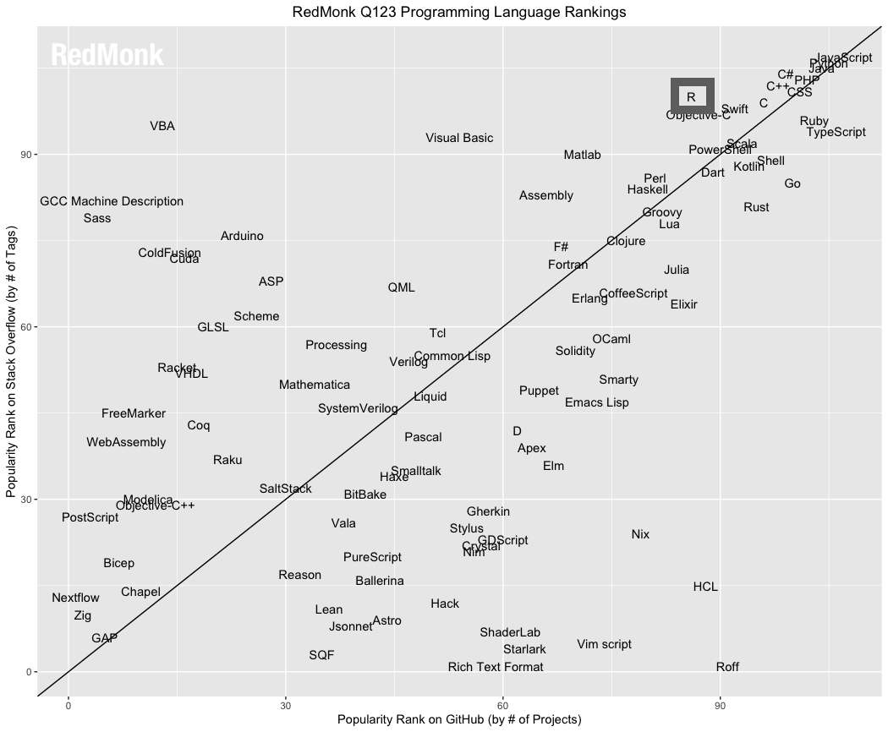

# Язык программирования R

.left-column[
```{r, echo=F, out.width = '100%'}
knitr::include_graphics('https://cran.r-project.org/Rlogo.svg')
```
<br><br>
Ядро R написано на таких языках как .blue[__C__] и .red[__Fortran__].
<br><br>
.small[Это дает высокую производительность встроенных функций]
]

.right-column[

- Язык R был разработали в 1991-1993 годах Росс Айхэка (Ross Ihaka) и Роберт Джентлмен (Robert Gentleman) из университета Окленда на базе языка S (разработан в Bell Labs Джоном Чемберсом (John Chambers) в 1976 году).


- И R и его предшественник S изначально создавались как специализированные языки для анализа данных.

> The aim of the language, as expressed by John Chambers, is .green[_"to turn ideas into software, quickly and faithfully"_]

- Многие специалисты предпочитают R для решения задач из области стастистики и анализа данных, поскольку на их взгляд он позволяет делать это _проще и элегантнее, чем другие языки программирования_. 

]

---

# Data science — наука о данных

Основная область применения R — это обработка и анализ данных. Академическая и прикладная дисциплина, в рамках которой изучаются соответствующие методы, называется .red[_наукой о данных_] или .blue[_data science_]. Считается, что первое определение этой науки дал датский учёный, лауреат премии Тьюринга, Петер Наур в 1974 году:

> __Наука о данных__ — это дисциплина, изучающая жизненный цикл цифровых данных — от появления до преобразования для представления в других областях знаний

С начала 2010-х гг профессия "дата сайнтиста" стала одной из наиболее востребованных и популярных в мире IT. В качестве инструментов часто используются такие языки программирования как __Python__, __R__, __Julia__, __JavaScript__.
<br><br>
Наука о пространственных данных (.green[spatial data science]) — междисциплинарная область на стыке геоинформатики и науки о данных. 

---

# Stackoverflow

Доля вопросов, касающихся R, существенно выросла за последние 10 лет.

```{r, echo=F, out.width = '60%'}
knitr::include_graphics('img/stacktrends.png')
```
https://insights.stackoverflow.com/trends

---

# Рейтинг популярности TIOBE

```{r setup, include=FALSE}
knitr::opts_chunk$set(fig.dim=c(4.8, 4.5), fig.retina=2, out.width="100%", collapse=T)
library(dplyr)
library(kableExtra)
```

.code-vsmall[
```{r}
library(tiobeindexr)
top_20()
```
]


---

# Рейтинг популярности PYPL

.left-40[
__PYPL__ _(PopularitY of Programming Language Index)_ — показывает, насколько часто люди ищут обучающие материалы по языкам программирования на _Google_

```{r, echo=F, out.width = '70%'}

```
https://pypl.github.io/PYPL.html
]

.right-60[
```{r, echo=F, out.width = '100%'}

```
]

---

# Ранг популярности на GitHub

.left-60[
```{r, echo=F, out.width = '90%'}

```
.vsmall[https://redmonk.com/sogrady/2023/05/16/language-rankings-1-23/]
]

.right-40[
R устойчиво находится в верхней квартили GitHub как по количеству репозиториев, так и по числу тегов, которые имеют к нему отношение
]

---

# Использование в индустрии

.pull-left[
```{r, echo=F, out.width = '100%'}
knitr::include_graphics('https://149351115.v2.pressablecdn.com/wp-content/uploads/2017/10/industry_growth_plot-1-768x768.png')
```
]

.pull-right[
Особенностью R является высокая популярность в академической среде и здравоохранении (для США и Канады).


.small[https://stackoverflow.blog/2017/10/10/impressive-growth-r/]
]

---

# Основные свойства языка R

.left-column[
```{r, echo=F, out.width = '120%'}
knitr::include_graphics('img/sanchez.png')
```
]

.right-column[
- .small[Несмотря на то, что __R__ изначально создавался для задач анализа данных, он .red[__является универсальным языком программирования__], на котором можно решать произвольные компьютерные задачи.]


- .small[__R__ является .red[__интерпретируемым__] языком. Программы на нём не компилируются, а выполняются построчно (интерпретируются), точно так же как это делается в _Python_ и _Matlab._]


- .small[Ядро __R__ написано на __C__ и __Fortran__, что обеспечивает .red[__высокое быстродействие встроенных функций__]. При этом R легко расширяется путем разработки пакетов на __R__ и __C++__]


- .small[Программы на __R__ пишутся в парадигме .red[__функционального программирования__]. Вместе с тем __R__ обладает развитыми системами классов, которые используются при создании пакетов (библиотек)]
]


---

# Присваивание

.pull-left[
Присваивание делается через `<-`:

```{r}
a <- 4
b <- a + 7
b
```

Может быть заменено на `=`:
```{r}
x = b / a
x
```
]

.pull-right[
Глобальное присваивание через `<<-`

.small[
```{r}
a = 4
b = 5
proc = function(x) {
  a = 2 # в пределах функции
  b <<- 2 # везде
  round(x / a, b)
}
proc(3.1415926)
a
b
```
]
]

---

# Функциональное программирование

.pull-left[
Каждый оператор в R реализован в виде функции:
```{r}
a = 7
`=`(b, -2)
a + b
`+`(a, b)
```

Извлечение элементов:
```{r}
samples = c(2, 4, 7, 9, 22)
samples[2:3]
`[`(samples, 2:3)
```
]]

.pull-right[
Функционалы и векторизованные вычисления:
.code-small[
```{r}
library(microbenchmark)

# 3 способа создать вектор квадратных
# корней от 1 до 1000
microbenchmark(
  for (i in 1:1000) { # цикл
    a[i] = sqrt(i)
  },
  b = sapply(1:1000, sqrt), # функционал
  c = sqrt(1:1000) # векторизация функции
) |> 
  summary() |> 
  pull(mean)
```
]
]

---

# Квотация аргументов функций

__Квотация__ _(quotation)_ — это использование имени переменной как обычной строки

.code-small[
```{r}
data(starwars, package='dplyr')
colnames(starwars)
```
]

.pull-left[
Обычный вызов функции:
.code-small[
```{r}
select(starwars, 'name', 'mass')
```
]]

.pull-right[
Вызов с квотацией аргументов:
.code-small[
```{r}
select(starwars, name, mass)
```
]]

---

# Конвейер передачи аргументов

__Пайп-оператор__ `|>` позволяет вставлять значения переменных в аргументы функций.

 - `x |> f` эквивалентно `f(x)`
 - `x |> f(y)` эквивалентно `f(x, y)`
 - `x |> f |> g |> h` эквивалентно `h(g(f(x)))`
 
Это чрезвычайно удобно при выполнении последовательности преобразований:

.pull-left[
```{r select, eval = FALSE}
starwars |>
  select(name, mass, sex) |> 
  filter(mass > 100) |>
  arrange(desc(mass)) |>
  head(5)
```
]

.pull-right[
.small-pre[
```{r select-out, ref.label="select", echo=FALSE}
```
]
]

.code-small[
```{r, eval = FALSE}
head(arrange(filter(select(starwars, name, mass), mass > 100), desc(mass)) # То же
```
]

---

# CRAN — Comprehensive R Archive Network

Язык R и пакеты (библиотеки) распространяются через CRAN. Каждый пакет проходит большое количество строгих автоматизированных проверок на работоспособность. В настоящий момент на CRAN доступно .red[__более 19500 пакетов__]!
```{r, echo = F}
knitr::include_url("https://cran.r-project.org/index.html")
```

---

# Tidyverse

__Tidyverse__ — широко используемый набор пакетов R для data science. В чем-то аналогичен pandas для Python, но имеет модульную структуру.

```{r, echo = F}

```
https://www.tidyverse.org

---

# Пространственные данные

R отличается хорошо развитой экосистемой пакетов для работы с пространственными данными. Умеет работать с ними автономно и путем взаимодействия с внешними библиотеками (GDAL, GEOS, PROJ, Leaflet) и ГИС-пакетами (QGIS, SAGA, GRASS, Whitebox).
```{r, echo = F}
knitr::include_graphics("img/spackages.png")
```

---

# Индивидуальные сайты пакетов

Большинство пакетов R хорошо документированы и имеют свой сайт
```{r, echo = F}
knitr::include_url("https://r-spatial.github.io/sf/")
```
https://r-spatial.github.io/sf/

---

# Шпаргалки

У создателей R есть замечательная традиция делать шпаргалки — _cheatsheets_
```{r, echo = F}
knitr::include_url("http://riatelab.github.io/cartography/vignettes/cheatsheet/cartography_cheatsheet.pdf")
```
http://riatelab.github.io/cartography/vignettes/cheatsheet/cartography_cheatsheet.pdf

---

# Тематические подборки

На CRAN есть полезные подборки пакетов по тематическим направлениям, которые ведутся экспертами. Например, так выглядит подборка пакетов по гидрологии:

```{r, echo = F}
knitr::include_url("https://cran.r-project.org/web/views/Hydrology.html")
```
https://cran.r-project.org/web/views/Hydrology.html

---

# RStudio

.left-30[
Многофункциональная среда разработки, позволяющая писать код, создавать библиотеки, визуализировать данные, выполнять их интерактивное исследование, создавать отчеты и сайты.

https://www.rstudio.com
]

.right-70[
```{r, echo = F}
knitr::include_graphics("https://d33wubrfki0l68.cloudfront.net/eea112c862c6881ff251757e5197329030a7dfec/cc90d/2020/05/27/rstudio-1-3-release/rstudio-1-3-screenshot.png")
```
]

---

# The R Journal

Высокорейтинговый журнал (.red[__Q1__] WoS, JCR 2020 = .green[3.984]) о развитии R и его библиотек

```{r, echo = F}
knitr::include_url("https://journal.r-project.org/")
```
https://journal.r-project.org/

---

# Journal of Statistical Software

Высокорейтинговый журнал (.red[__Q1__] WoS, JCR 2019 = .green[13.642]) о разработке статистического программного обеспечения (большинство разработок сделано на .blue[__R__])

```{r, echo = F}
knitr::include_url("https://www.jstatsoft.org/index")
```
https://www.jstatsoft.org/index

---

# Конференция UseR!

Ежегодная международная конференция, на которой собираются специалисты по языку R и разработчики его пакетов.

```{r, echo = F}
knitr::include_url("https://user2022.r-project.org")
```
https://user2022.r-project.org

---

# Учебный курс

Курс _"Визуализация и анализ географических данных на языке R"_ позволяет освоить программирование на R с нуля до уровня уверенного пользователя.

```{r, echo = F}
knitr::include_url("https://tsamsonov.github.io/r-geo-course/index.html")
```
https://tsamsonov.github.io/r-geo-course/

---

# Продолжение

Курс _"Пространственная статистика и моделирование на языке R"_  позволяет выйти на профессиональный уровень в области анализа пространственных данных:

```{r, echo = F}
knitr::include_url("https://tsamsonov.github.io/r-spatstat-course/index.html")
```
https://tsamsonov.github.io/r-spatstat-course/

---

class: center, middle

# Приятного путешествия в мир R и Data Science!
