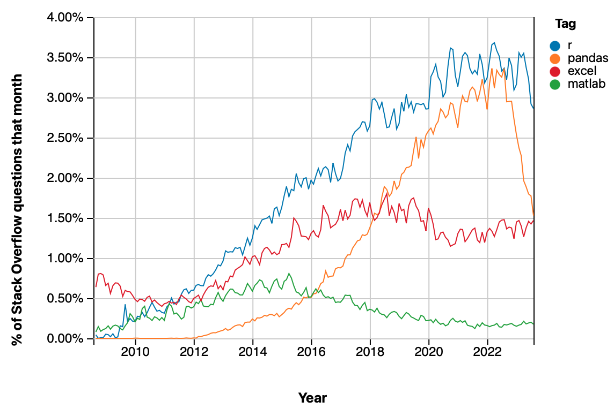
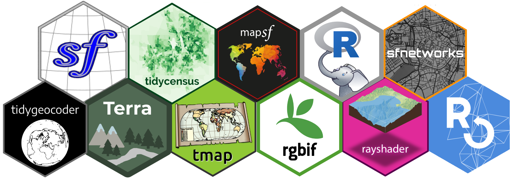

# Язык программирования R

.left-column[
```{r, echo=F, out.width = '100%'}
knitr::include_graphics('https://cran.r-project.org/Rlogo.svg')
```
<br><br>
R core is written in .blue[__C__] и .red[__Fortran__].
<br><br>
.small[Base functions are of high performance]
]

.right-column[

- R language was developed in 1991-1993 by Ross Ihaka and Robert Gentleman from The University of Auckland based on __S__ language (developed by John Chambers in Bell Labs in 1976).


- Both R and its predecessor S were initially developed as specialized statistical (and further data science) languages.

> The aim of the language, as expressed by John Chambers, is .green[_"to turn ideas into software, quickly and faithfully"_]

- That is why many data science tasks can be solved using R in a more elegant and concise way than in most of other programming languages. 

]

---

# Stackoverflow

R's share in stackoverflow questions has increased substantially during the last decade.

```{r, echo=F, out.width = '65%'}

```
https://insights.stackoverflow.com/trends

---

# TIOBE rating

```{r setup, include=FALSE}
knitr::opts_chunk$set(fig.dim=c(4.8, 4.5), fig.retina=2, out.width="100%", collapse=T)
library(dplyr)
library(kableExtra)
```

.code-small[
```{r}
library(tiobeindexr)
top_20()
```
]

---

# R popularity on GitHub

.left-60[
```{r, echo=F, out.width = '95%'}

```
.vsmall[https://redmonk.com/sogrady/2021/08/05/language-rankings-6-21/]
]

.right-40[
R is steadily located in Q1 of GitHub both by the number of repositories, and the number of tags
]

---

# Popularity in indistry (USA and Canada)

.pull-left[
```{r, echo=F, out.width = '100%'}
knitr::include_graphics('https://149351115.v2.pressablecdn.com/wp-content/uploads/2017/10/industry_growth_plot-1-768x768.png')
```
]

.pull-right[
R is most popular in academy and public health


.small[https://stackoverflow.blog/2017/10/10/impressive-growth-r/]
]

---

# The R Journal

High-ranking journal (.red[__Q1__] WoS, JCR 2020 = .green[3.984]) about development of R and its packages

```{r, echo = F}
knitr::include_url("https://journal.r-project.org/")
```
https://journal.r-project.org/

---

# Journal of Statistical Software

High-ranking journal (.red[__Q1__] WoS, JCR 2020 = .green[6.440]), most of the software is written in .blue[__R__]

```{r, echo = F}
knitr::include_url("https://www.jstatsoft.org/index")
```
https://www.jstatsoft.org/index

---

# General properties of R

.left-column[
```{r, echo=F, out.width = '120%'}

```
]

.right-column[
- .small[Despite the fact that __R__ was initally developed for data analysis purposes, it is in fact a .red[__universal general-purpose language__] for computing.]

- .small[__R__ is .red[__interpreted__] language. The programs are not compiled, but rather are executed row-by-row, similarly to _Python_ or interpreted version of _Matlab._]

- .small[The __R__ core is written in __C__ and __Fortran__, which provides .red[__high performance of base functions__]. R is easily extended by user packages written in __R__ and __C++__]

- .small[__R__ programs are typically written in .red[__functional__] programming paradigm. However, __R__ provides the powerful and diverse set of object-oriented programming systems (S3, S4, R6) which are used typically for package development]
]


---

# Assignment

.pull-left[
Traditional assignment operator is `<-`:

```{r}
a <- 4
b <- a + 7
b
```

Can be replaced with `=`:
```{r}
x = b / a
x
```
]

.pull-right[
Global assignment to the variable from enclosing environment is made by `<<-`

.small[
```{r}
a = 4
b = 5
proc = function(x) {
  a = 2 # inside function
  b <<- 2 # everywhere
  round(x / a, b)
}
proc(3.1415926)
a
b
```
]
]

---

# Functional programming

.pull-left[
Every operation in R is in fact a _function_:
```{r}
a = 7
`=`(b, -2)
a + b
`+`(a, b)
```

Extraction of elements:
```{r}
samples = c(2, 4, 7, 9, 22)
samples[2:3]
`[`(samples, 2:3)
```
]]

.pull-right[
Functionals and vectorized computations:
.code-small[
```{r}
library(microbenchmark)

# 3 ways to build a vector
# of square roots from 1 to 1000
microbenchmark(
  for (i in 1:1000) { # cycle
    a[i] = sqrt(i)
  },
  b = sapply(1:1000, sqrt), # functional
  c = sqrt(1:1000) # vectorized function
) |> 
  summary() |> 
  pull(mean)
```
]
]

---

# Quotation

__Quotation__ is roughly a use of the variable name as the _data_

.code-small[
```{r}
data(starwars, package='dplyr')
colnames(starwars)
```
]

.pull-left[
Evaluated function argumants:
.code-small[
```{r}
select(starwars, 'name', 'mass')
```
]]

.pull-right[
Quoted function arguments:
.code-small[
```{r}
select(starwars, name, mass)
```
]]

---

# Function pipeline

__Pipe operator__ `|>` passes the left operand as a first argument of the right operand.

 - `x |> f` is equivalent to `f(x)`
 - `x |> f(y)` is equivalent to `f(x, y)`
 - `x |> f |> g |> h` is equivalent to `h(g(f(x)))`
 
This is highly convenient in processing sequences with multiple steps:

.pull-left[
```{r select, eval = FALSE}
starwars |>
  select(name, mass, sex) |> 
  filter(mass > 100) |>
  arrange(desc(mass)) |>
  head(5)
```
]

.pull-right[
.small-pre[
```{r select-out, ref.label="select", echo=FALSE}
```
]
]

.code-small[
```{r, eval = FALSE}
head(arrange(filter(select(starwars, name, mass), mass > 100), desc(mass)) # То же
```
]

---

# CRAN — Comprehensive R Archive Network

R language itself and its packages are distributed through CRAN. Every package passes numerous strict checks and is compiled on multiple platforms (Windows, Linux, Solaris, macOS) before it is published on CRAN. Currently there are .red[__more than 18000 packages__] published!
```{r, echo = F}
knitr::include_url("https://cran.r-project.org/index.html")
```

---

# Tidyverse

__Tidyverse__ is a widely used set of data science packages developed by RStudio. It is somewhat similar to __pandas__ for Python, but has modular structure.

```{r, echo = F}
knitr::include_graphics("img/tidyverse.png")
```
https://www.tidyverse.org

---

# Package 

Many R packages are well documented and have dedicated web site
```{r, echo = F}
knitr::include_url("https://r-spatial.github.io/sf/")
```
https://r-spatial.github.io/sf/

---

# Cheatsheets

There is a nice tradition in R community — package _cheatsheets_
```{r, echo = F}
knitr::include_url("http://riatelab.github.io/cartography/vignettes/cheatsheet/cartography_cheatsheet.pdf")
```
http://riatelab.github.io/cartography/vignettes/cheatsheet/cartography_cheatsheet.pdf

---

# Thematic CRAN views

CRAN provides a grouped view of packages. Each view is dedicated to some application area and is curated by experts in the field. For example, there is a package view dedicated to hydrology:

```{r, echo = F}
knitr::include_url("https://cran.r-project.org/web/views/Hydrology.html")
```
https://cran.r-project.org/web/views/Hydrology.html

---

# RStudio

.left-30[
Powerful IDE, which allows writing R code, creating packages, data visualization, interactive data exploration, careating reports, books and websites.

https://www.rstudio.com
]

.right-70[
```{r, echo = F}
knitr::include_graphics("https://d33wubrfki0l68.cloudfront.net/eea112c862c6881ff251757e5197329030a7dfec/cc90d/2020/05/27/rstudio-1-3-release/rstudio-1-3-screenshot.png")
```
]

---

# Spatial data

R has highly developed package ecosystem for working with spatial data. Some of the packages rely on external spatial libraries (GDAL, GEOS, PROJ, Leaflet) and GIS packages (QGIS, SAGA, GRASS, Whitebox).
```{r, echo = F}

```

---

# Spatial data models

```{r}

```

