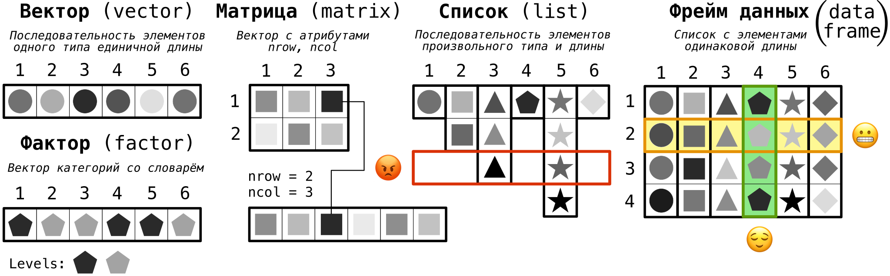

# Структуры данных в R

```{r setup, echo = FALSE, purl = FALSE, cache = FALSE, include=FALSE}
knitr::opts_knit$set(global.par = TRUE)
knitr::opts_chunk$set(warning=FALSE, collapse = TRUE)
```

```{r, echo=F, out.width = '100%'}

```
> __Структура данных__ — это программная единица, позволяющая хранить и обрабатывать множество однотипных и/или логически связанных данных.

---

# Векторы

Для создания вектора путем __перечисления__ элементов используется функция `c()`:
```{r, collapse=TRUE}
colors = c("Красная", "Зеленая", "Синяя", "Коричневая", "Оранжевая")
colors
```

```{r, collapse=TRUE}
lengths = c(41, 43, 45, 19, 38)
lengths
```

```{r, collapse=TRUE}
opens = c(FALSE, TRUE, TRUE, FALSE, FALSE)
opens
```

---

# Генерация последовательности

.pull-left[
Арифметическая с шагом 1:
```{r, collapse=TRUE}
index = -2:2 # эквивалентно c(1,2,3,4,5)
index
seq_along(index)
```
]

.pull-right[
Случайная:
```{r}
runif(5, 0, 100) # равномерное
rnorm(5, 10, 5) # нормальное
```
]

Арифметическая общего вида:
```{r, collapse=TRUE}
seq(from = 1, by = 2, length.out = 10)
seq(from = 2, to = 20, by = 3)
seq(length.out = 10, to = 2, by = -2)
```

---

# Извлечение и условия

.pull-left[
Извлечение по индексам:
```{r, collapse=TRUE}
colors[3]
lengths[1:4] 
lengths[c(5, 1, 4, 2)]
```
]

.pull-right[
Извлечение по условию:
```{r}
lengths
lengths > 40
lengths[lengths > 40]
```
]

Формирование по условию:
```{r}
ifelse(lengths > 40, 'Длинная', 'Короткая')
```

---

# Преобразования и статистики

.pull-left[
Преобразования:
```{r, collapse=TRUE}
lengths * 1000 
sqrt(lengths)
stations = c(26, 24, 22, 12, 24)
stations / lengths
```
]

.pull-right[
Статистики:
```{r, collapse=TRUE}
min(lengths)
max(lengths)
mean(lengths)
```
]

Описательные статистики:
```{r}
summary(lengths)
```

---

# Поиск и сортировка

.pull-left[
__Поиск__
```{r, collapse=TRUE}
# Исходный вектор
lengths

# максимальное значение
(l = max(lengths)) 

# индекс максимального элемента
(idx = match(l, lengths)) 

# извлечение
(color = colors[idx])
```
]

.pull-right[
__Сортировка__
```{r, collapse=TRUE}
# по возрастанию значений
sort(lengths)

# по убыванию значений
sort(lengths, decreasing = TRUE)

# какой порядок значений?
order(lengths)

# сортировка по упорядоченным индексам
lengths[order(lengths)]
```
]

---

# Факторы

__Фактор__ — категориальный вектор со словарем допустимых значений:
```{r}
depot = c('Северное', 'Черкизово', 'Сокол', 'Замоскворецкое', 
          'Братеево', 'Измайлово', 'Фили', 'Митино', 
          'Красная Пресня', 'Калужское', 'Свиблово')
line_number = c(1, 1, 2, 2, 2, 3, 3, 3, 5, 6, 6)
summary(line_number)
(line_number = as.factor(line_number))
summary(line_number)
```

---

# Матрицы

.pull-left[
Создание
```{r, collapse=TRUE}
v = 1:12
m = matrix(v, nrow = 3, ncol = 4)
m
matrix(v, nrow = 3, byrow = TRUE)
```
]

.pull-right[
Индексирование:
```{r, collapse=TRUE}
m[2,4]  # 2 строка, 4 толбец
m[2,]  # 2 строка
m[,3]  # 3 cтолбец
```

Преобразование:
```{r}
log(m)  # натуральный логарифм ото всех элементов
```

]

---

# Матрицы

.pull-left[
Транспонирование:
```{r, collapse=TRUE, error = TRUE}
t(m)  # транспонированная матрица
m2 = matrix(-3:3,nrow = 3, ncol = 3)
det(m2) # определитель матрицы
```
]

.pull-right[
Умножение с помощью `%*%`:
```{r, collapse=TRUE, error = TRUE}
m2 %*% m
```

Сортировка создает вектор:
```{r, collapse=TRUE, error = TRUE}
sort(m)
```
]


---

# Матрицы

.pull-left[
Поиск элементов:
```{r, collapse=TRUE}
m
indexes = which(m == 8, 
                arr.ind = TRUE)
row = indexes[1,1]
col = indexes[1,2]
m[row,col]
```
]

.pull-right[
Сборка из векторов:
```{r, collapse=TRUE}
lengths = c(28, 40, 45, 19, 38)
stations = c(20, 21, 22, 12, 24)
cbind(lengths, stations)  # соединим вектора в качестве столбцов
rbind(lengths, stations)  # соединим вектора в качестве строк
```
]

---

# Списки

.pull-left[
Создание:
```{r}
list(lengths, summary(lengths))
(res = list(data = lengths, 
           sum  = summary(lengths)))
```
]

.pull-right[
Извлечение:
```{r}
res[1] # список!
res["sum"]  # список!
res[[1]]  # элемент!
res[["sum"]]  # элемент!
res$sum
```
]


---

# Фреймы данных

__Фрейм данных__ — это список, в котором все элементы строго одинаковой длины

```{r, collapse=TRUE}
(df = data.frame(colors,lengths,stations))
```

К фреймам также можно пристыковывать новые столбцы:
```{r, collapse=TRUE}
(df = cbind(df, dens = stations / lengths))
```

---

# Фреймы данных

Извлечение элементов фрейма данных — гибрид возможностей матрицы и списка

.pull-left[
__Как матрица__:
```{r, collapse=TRUE}
df
df[2,2]
df[,3]
df[4,] # ДОРОГО!
```
]

.pull-right[
__Как список__:
```{r}
df[3]
df[[3]]
df$stations
df[['stations']]
```
]

---

# Фреймы данных

Вычисления:
```{r, collapse=TRUE}
max(df$stations)
df$ratio = df$lengths / df$stations
df
```

Названия столбцов:
```{r, collapse=TRUE}
colnames(df)
```

---

# Фреймы данных

Чтобы присоединить строку, сначала можно создать фрейм данных из одной строки и перенести в него названия столбцов:
```{r, collapse=TRUE}
row = data.frame("Фиолетовая", 40.5, 22, 22/45, 45/22)
colnames(row) = colnames(df)
```

После того как столбцы приведены в соответствие, можно присоединить новую строку:
```{r, collapse=TRUE}
(df = rbind(df,row))
```

---

# Фреймы данных

.pull-left[
Сортировка:
```{r}
df[order(df$lengths), ]
```
]
.pull-right[
Фильтрация:
```{r}
df[df$lengths > 25, ]
```
]

---

# Фреймы данных

Описательные статистики:
```{r}
summary(df)
```


---

# Описание структуры данных

```{r}
typeof(df) # тип структуры данных
class(df) # класс объекта
str(df) # структура объекта
```

---

# Циклы

.left-40[
```{r, collapse = TRUE}
for (i in 1:5) print(i)

i = 1
while(i < 5) {
  i = 2 * i
  print(i)
}
```
]

.right-60[
```{r, collapse = TRUE}
for (i in 1:10) {
  a = factorial(i) # факториал i
  b = exp(i) # e в степени i
  print(a/b) # факториал растет быстрее экспоненты
}
```
]

---

# Циклы

Пример по столбцам — вычисление медианы каждой переменной:
```{r}
n = ncol(df)
medians = vector('numeric', n)

for (i in 1:n) {
  if(is.numeric(df[, i])){
    medians[i] = median(df[, i])
  } else {
    medians[i] = NA
  }
}
colnames(df) # Переменные
medians # Медианные значения
```

---

# Циклы

Пример по строкам — вывод информации о каждой станции:
```{r}
k = nrow(df)

for (i in 1:k) {
  cat(df[i, 'colors'],  'ветка метро имеет длину', 
      df[i, 'lengths'], 'км', fill = TRUE)
}
```

---

# Циклы

- `break` прерывает цикл
- `next` прерывает текущую итерацию цикла

```{r, eval=FALSE}
while (TRUE) {
  cat('Введите номер ветки метро:')
  input = readline()
  if (input == 'q')
    break
  else {
    n = as.numeric(input)
    if (!is.na(n))
      depots[depots$line_number == n, ]
  }
}
```
