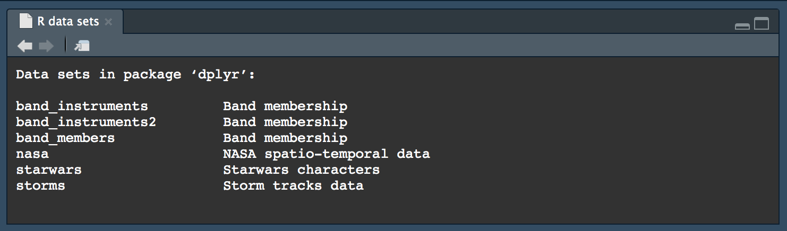
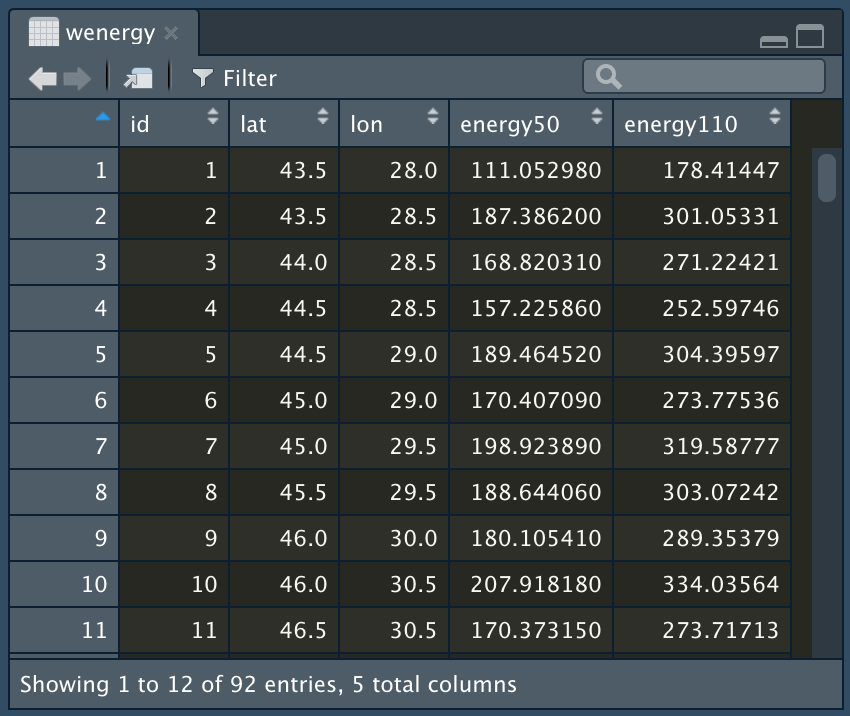

```{r setup, echo = FALSE, purl = FALSE, cache = FALSE, include=FALSE}
knitr::opts_chunk$set(warning=FALSE, collapse=TRUE)
```

## Tidyverse

Пакет       | Назначение
------------|-----------
__ggplot2__ | Построение графиков на основе правил грамматики
__tibble__  | Усовершенствованный вариант фрейма данных
__dplyr__   | Грамматика манипуляций над табличными данными
__tidyr__   | Приведение таблиц в аккуратный вид, удобный для обработки
__readr__   | Чтение табличных данных из текстовых файлов
__readxl__  | Чтение табличных данных из файлов Microsoft Excel
__purrr__   | Функциональное программирование
__rlang__   | Расширение возможностей языка
__stringr__ | Работа со строками
__forcats__ | Автоматизация работы с факторами

---

## Тибблы

__Тиббл__ представляет собой фрейм данных с более строгим поведением

```{r}
library(tibble)
```

.pull-left[
```{r}
tibble(
  a = 1:3, 
  b = 1, 
  c = -1:1
)
```
]

.pull-right[
```{r}
tribble(
  ~a, ~b, ~c,
   1,  1, -1,
   2,  1,  0,
   3,  1,  1
)
```
]


---

## Встроенные данные

```{r, eval=FALSE}
data(package = 'dplyr')
```

```{r, out.width='100%', echo = FALSE}

```

---

## Встроенные данные

```{r}
data(starwars, package = 'dplyr')
starwars
```

---

## Файлы с разделителем

```{r}
library(readr)
(okruga = read_csv('../r-geo-course/data/okruga.csv'))
```

---

# Файлы с фиксированной шириной столбца

```{r}
(wenergy = read_table('../r-geo-course/data/wind_energy.txt', 
                      col_names = c('id', 'lat', 'lon', 'energy50', 'energy110')))
```

---

## Таблицы Microsoft Excel

```{r}
library(readxl)
(reforest = read_excel('../r-geo-course/data/reforest.xlsx', 
                       col_types = c('text', rep('numeric', 8))))
```

---

# Просмотр

```{r, collapse=TRUE}
head(reforest) # по умолчанию 6
tail(reforest, 3)
```

---

## Функция View()

.pull-left[
__RStudio__ предоставляет графический интерфейс для просмотра таблиц, в котором таблицу можно сортировать и фильтровать:
```{r, eval = FALSE, collapse=TRUE}
View(wenergy)
```

> .red[__Внимание:__ не следует оставлять вызовы функции `View()` в тексте законченной программы. Используйте ее только для отладочных целей.]
]

.pull-right[
```{r, echo=F}

```
]

---

## Грамматика манипуляций dplyr

Функция       | Назначение
--------------|-----------------
`select()`    | Выбор переменных
`filter()`    | Выбор строк (фильтрация)
`arrange()`   | Упорядочение строк
`mutate()`    | Мутирование — добавление и изменение переменных
`transmute()` | Трансмутирование — мутирование с отбрасыванием переменных
`relocate()`  | Изменение порядка столбцов
`pull()`      | Извлечение столбца как вектора
`group_by()`  | Группировка строк (для последующего агрегирования)
`rowwise()`   | Группировка построчная
`summarise()` | Агрегирование значений переменных

---

# Грамматика манипуляций

Для начала переименуем столбцы с годами, чтобы их названия начинались с буквы `y`:
```{r}
old_names = colnames(reforest)
colnames(reforest) = c(old_names[1], 
                       paste('y', old_names[-1], sep = ''))
head(reforest)
```

---

## Выбор переменных

```{r}
library(dplyr)
(rdf = select(reforest, Region, y2010, y2015))
```

---

## Выбор переменных

Можно исключать (`-`) столбцы и указывать диапазоны (`:`) названий:

```{r}
(rdf = select(reforest, -y2005, -y2011:-y2014, -y2016))
```

---

## Выбор строк (фильтрация)

```{r}
filter(rdf, y2015 > 50)
```

---

## Выбор строк (фильтрация)

```{r}
library(stringr)
flt = str_detect(rdf$Region, 'Федерация|федеральный округ')
flt
regdf = filter(rdf, !flt) # применяем фильтр
head(regdf)
```


---

## Сортировка

```{r}
arrange(regdf, y2015) # по возрастанию
```

---

## Добавление или изменение переменных

```{r}
regdf = mutate(regdf, delta = y2015 - y2010)
regdf
```

---

## Трансмутирование

`transmute()` сохраняет только столбцы, указанные в параметрах
```{r}
transmute(regdf, Region, delta = y2015 - y2010) # сохраняем только Region и delta
```

---

## Агрегирование

```{r}
summarise(regdf, 
          sumforest = sum(y2015, na.rm = TRUE),
          minforest = min(y2015, na.rm = TRUE),
          maxforest = max(y2015, na.rm = TRUE))
```

---

## Агрегирующие функции

В пакете __dplyr__ также имеются полезные агрегирующие функции:

- `n()` вычисляет количество элементов.

- `n_distinct()` вычисляет количество уникальных элементов.

- `first(x)`, `last(x)` и `nth(x, n)` извлекают, первый, последний и n-ный элемент. 

---

## Группировка

Исходные данные:
```{r, echo=FALSE}
library(tidyr)
flt2 = str_detect(rdf$Region, 'федеральный округ') # ищем округа
rdf2 = mutate(rdf, okrug = if_else(flt2, Region, NA)) # перенесем названия округов в новый столбец
rdf2 = fill(rdf2, okrug) # заполним все пустые строчки предыдущим значением
(regdf = filter(rdf2, !flt)) # оставим только регионы
```

---

## Группировка

`group_by()` + `row_number()`: регион с максимальной величиной показателя в каждом округе:
```{r}
regdf_gr = group_by(regdf, okrug)
regdf_arr = arrange(regdf_gr, desc(y2015))
(regdf_res = filter(regdf_arr, row_number() == 1))
```

---

## Группировка

`group_by()` + `summarise()`: суммарный объем лесовосстановительных работ по округам:
```{r}
regdf_gr = group_by(regdf, okrug)
summarise(regdf_gr, total = sum(y2015, na.rm = TRUE))
```

---

## Конвейер манипуляций

 __Пайп-оператор `|>`__ предназначен для компактной и наглядной записи _последовательностей_ обработки данных. Работает он следующим образом:

 - `x |> f` эквивалентно `f(x)`
 
 - `x |> f(y)` эквивалентно `f(x, y)`
 
 - `x |> f |> g |> h` эквивалентно `h(g(f(x)))`

> Пайп-оператор можно быстро набрать в RStudio, нажав клавиатурное сочетание <kbd>Ctrl</kbd> + <kbd>Shift</kbd> + <kbd>M</kbd> (<kbd>Cmd</kbd> + <kbd>Shift</kbd> + <kbd>M</kbd> на помпьютерах Mac)

---

## Конвейер манипуляций

С помощью пайп-оператора код по нахождению региона-лидера можно записать так:
```{r, echo = FALSE}
library(tidyr)
regdf = rdf |> 
  mutate(okrug = if_else(flt2, Region, NA)) |> 
  fill(okrug) |> 
  filter(flt)
```
```{r, collapse=TRUE}
leaders = regdf |>
  group_by(okrug) |>
  arrange(desc(y2015)) |>
  filter(row_number() == 1)

head(leaders)
```

---

## Сравнение

.pull-left[
Традиционно:
```{r, collapse=TRUE}
leaders = filter(
            arrange(
              group_by(
                regdf, 
                okrug
              ),
              desc(y2015)
            ),
            row_number() == 1
          )
```
]

.pull-right[
С помощью конвейера:
```{r, collapse=TRUE}
leaders = regdf |>
  group_by(okrug) |> 
  arrange(desc(y2015)) |> 
  filter(row_number() == 1)
```
]

---

## Преобразование структуры

Функции пакета __tidyr__

- `pivot_longer()`: широкие таблицы в длинные.

- `pivot_wider()`: длинные таблицы в широкие.

> В tidyr более ранних чем 1.0.0 версий для этих целей использовались функции `gather()` и `spread()`

Вспомогательные:

- `separate()`: разделить столбец.

- `unite()`: соединить несколько столбцов.

---

## Преобразование структуры

`pivot_longer()`: широкая форма в длинную форму
```{r}
library(tidyr)
(reforest_tidy = reforest |>
    pivot_longer(cols = y2005:y2016,
                 names_to = 'year', 
                 values_to = 'value')
)
```

---

## Преобразование структуры

`separate()` + `select()` + `mutate()`: разделить столбец `year`
```{r}
(reforest_tidy = reforest_tidy |> 
  separate(year, c('y', 'year'), 1) |>
  select(-y) |>
  mutate(year = as.integer(year)))
```

---

## Преобразование структуры

`filter()`
```{r}
reforest_tidy |>
  filter(year > 2011 & year < 2016 & value == 0)
  
```

---

## Преобразование структуры

`pivot_wider()`: длинная форма в широкую форму
```{r}
(reforest = reforest_tidy |>
   pivot_wider(names_from = year, 
               values_from = value)
 )
```

---

## Соединение (мутирующее)

- `inner_join(x, y, by = )` возвращает все строки из `x`, для которых имеются соответствующие строки в `y`, а также все столбцы из `x` и `y`.
<br><br>
- `left_join(x, y, by = )` возвращает все строки из `x`, а также все столбцы из `x` и `y`. Строки в `x`, для которых не найдены соответствия в `y`, будут иметь значения `NA` в присоединенных столбцах
<br><br>
- `right_join(x, y, by = )` возвращает все строки из `y`, а также все столбцы из `x` и `y`. Строки в `y`, для которых не найдены соответствия в `x`, будут иметь значения `NA` в присоединенных столбцах
<br><br>
- `full_join(x, y, by = )` возвращает все строки и колонки из `x` и `y`. В строках, для которых не найдено соответствие ячейки присоединяемых столбцов будут заполнены значениями `NA`

---

## Соединение (фильтрующее)

- `semi_join(x, y, by = )` возвращает все строки из `x`, для которых имеются соответствующие строки в `y`, а также все столбцы из `x`
<br><br>
- `anti_join(x, y, by = )` возвращает все строки из `x`, для которых _не_ найдены соответствующие строки в `y`, а также все столбцы из `x`

---

## Соединение

Таблица по лесозаготовкам:
```{r}
(timber = read_excel('../r-geo-course/data/timber.xlsx', 
                    col_types = c('text', rep('numeric', 8))) |>
  filter(!str_detect(Регион, 'Федерация|федеральный округ')))
```

---

## Соединение

Приводим в аккуратный вид:
```{r}
(timber_tidy = timber |>
  pivot_longer(`2010`:`2016`, names_to = 'year', values_to = 'harvest') |>
  transmute(Region = Регион,
            year = as.numeric(year),
            harvest = harvest))
```

---

## Соединение

`inner_join()`: соединяем лесозаготовки и лесовосстановление по региону и году
```{r}
(compare = reforest_tidy |> 
  inner_join(timber_tidy, 
             by = c("Region" = "Region", 
                    "year" = "year"))
)
```

---

## Соединение

Вычисляем соотношение:
```{r}
(compare = compare |> 
   mutate(ratio = 1000 * value / harvest) |> 
   select(Region, year, ratio, value, harvest) |> 
   arrange(year, desc(ratio)))
```

---

## Экспорт в файл


Файлы с разделителем
```{r}
write_csv(compare, "../r-geo-course/data/output/timber_compare.csv")
```

файлы Excel:
```{r}
library(writexl)
write_xlsx(compare, "../r-geo-course/data/output/timber_compare.xlsx")
```

---

## Рекомендации по подготовке таблиц для чтения в R

- В первой строке таблицы должны располагаться названия столбцов.

- Во второй строке таблицы должны начинаться данные. Не допускайте многострочных заголовков.

- В названиях столбцов недопустимы объединенные ячейки, покрывающие несколько столбцов. Это может привести к неверному подсчету количества столбцов и, как следствие, некорректному чтению таблицы в целом.

- Названия столбцов должны состоять из латинских букв и цифр, начинаться с буквы и не содержать пробелов. Плохое название столбца: `Валовый внутренний продукт за 2015 г.`. Хорошее название столбца: `GDP2015`.

- Некоторые ошибки данных в таблицах (такие как неверные десятичные разделители), проще найти и исправить в табличном/текстовом редакторе, нежели после загрузки в __R__.
