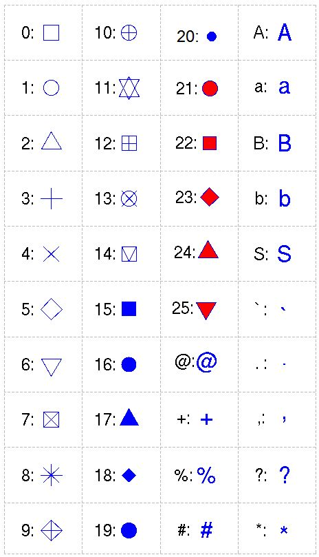

```{r setup, echo = FALSE, purl = FALSE, cache = FALSE, include=FALSE}
library(datasets)
knitr::opts_knit$set(global.par = TRUE)
knitr::opts_chunk$set(warning=FALSE, collapse=TRUE,dpi=300)
```

# Исходные данные

__Исходные данные:__ экспорт/импорт продукции по регионам России (млн долл. США):

```{r, echo=FALSE, warning=FALSE}
library(readxl)

# Прочтем таблицу по экспорту/импорту продукции в регионах России 
types = c("text", rep("numeric", 12))
tab = read_excel("../r-geo-course/data/ExpImp.xlsx", 1, col_types = types)

# Выгрузим данные по федеральным округам в отдельную таблицу
filter = grep("федеральный округ", tab$Регион)
okr = tab[filter, ]

# Отсортируем данные по федеральным округам в алфавитном порядке:
okr = okr[order(okr$Регион), ]

# Выгрузим данные по субъектам в отдельную таблицу
filter = grepl("федеральный округ|Федерация|числе",tab$Регион)
sub = tab[!filter, ]
sub[1:12, 1:5]
```

---

# Диаграммы рассеяния

.pull-left[

Диаграмма расеяния показывает соотношение двух переменных на точечном графике
.code-small[
```{r scat, eval = FALSE}
plot(sub$МетЭкспорт, 
     sub$МетИмпорт,
     col="red", 
     xlab="Экспорт, млн. долл. США", 
     ylab = "Импорт, млн. долл. США", 
     main = "Экспорт/импорт металлов и 
     изделий из них по субъектам РФ")
```
]]

.pull-right[
```{r select-out, ref.label="scat", echo=FALSE, dpi=300}
```
]


---

# Диаграммы рассеяния

.pull-left[
Если показатели однородны, то целесообразно установить одинаковый масштаб по осям через параметр `asp`:
.code-small[
```{r scat2, eval = FALSE}
plot(sub$МетЭкспорт, 
     sub$МетИмпорт, 
     col="red", 
     xlab="Экспорт, млн. долл. США", 
     ylab = "Импорт, млн. долл. США", 
     main = "Экспорт/импорт металлов и 
     изделий из них по субъектам РФ", 
     asp = 1) #<<
```
]
]

.pull-right[
```{r select-out, ref.label="scat2", echo=FALSE, dpi=300}
```
]


---

# Диаграммы рассеяния

_Размер и тип значка_ можно изменить, используя параметры `pch =` и `cex =`:

.left-60[
.code-small[
```{r out.width = '60%'}
plot(sub$МетЭкспорт, sub$МетИмпорт, col="red", xlab="Экспорт, млн. долл. США", ylab = "Импорт, млн. долл. США", main = "Экспорт/импорт металлов и изделий из них по субъектам РФ", asp = 1,
     pch = 18, cex = 4) #<<
```
]
]

.right-40[
```{r, echo=FALSE, out.width='65%'}

```
]


---

# Линейные графики

Данные по объему сброса загрязненных сточных вод по морям России (млрд куб. м):
```{r, echo = FALSE}
library(readr)
(tab = read_csv2("../r-geo-course/data/oxr_vod.csv", col_types = cols()))
```

---

# Линейные графики

Тип графика определяется через параметр `type`

.pull-left[
.code-small[
```{r, out.width='80%'}
plot(tab$Год, tab$Каспийское, type="l")
```
]
]

.pull-right[
.code-small[
```{r, out.width='80%'}
plot(tab$Год, tab$Каспийское, type="b")
```
]
]

---

# Линейные графики

Толщина и тип устанавливаются через параметры `lwd` и `lty`:

.pull-left[
.code-small[
```{r, out.width='80%'}
plot(tab$Год, tab$Каспийское, 
     type="l", lwd = 3, lty = 1)
```
]
]

.pull-right[
.code-small[
```{r, out.width='80%'}
plot(tab$Год, tab$Каспийское, 
     type="l", lwd = 6, lty = 3)
```
]
]

---

# Совмещение графиков

.pull-left[
```{r combine, eval=F}
plot(tab$Год, 
     tab$Азовское, 
     pch=20, 
     type="o", 
     col="red3")

# Добавим теперь на существующий 
# график новый ряд данных,  
# используя points() и lines():

points(tab$Год, tab$Карское,
       pch=20, col="forestgreen")

lines(tab$Год, tab$Карское,
      pch=20, col="forestgreen")
```
]

.pull-right[
```{r combine-out, ref.label="combine", echo = FALSE}
```
]

---

# Совмещение графиков

Заранее вычислить диапазон по осям можно через `range`

.pull-left[
.code-small[
```{r combine2, eval = FALSE}
xrange = range(tab$Год) #<<
yrange = range(tab$Каспийское,  #<<
               tab$Карское,  #<<
               tab$Азовское) #<<
# n означает, что ряд данных 
# рисоваться не будет
plot(xrange, yrange,  #<<
     type = "n",  #<<
     main="Объем сброса загрязненных сточных вод", xlab="Год", ylab="млрд.куб.м", ) 

points(tab$Год, tab$Азовское, pch=20, col="red3")
lines(tab$Год, tab$Азовское, pch=20, col="red3")

points(tab$Год, tab$Карское, pch=20, col="forestgreen")
lines(tab$Год, tab$Карское, pch=20, col="forestgreen")

points(tab$Год, tab$Каспийское, pch=20, col="steelblue")
lines(tab$Год, tab$Каспийское, pch=20, col="steelblue")
```
]
]

.pull-right[
```{r combine2-out, ref.label="combine2", echo = FALSE}
```
]

---

# Функциональные параметры

Графические параметры могут быть _функцией_ данных:

.pull-left[
.code-small[
```{r funcpar, eval=F}
plot(okr$МетЭкспорт, 
     okr$МетИмпорт, 
     col=rgb(1,0,0,0.5), 
     xlab="Экспорт, млн. долл. США", 
     ylab = "Импорт, млн. долл. США", 
     main = "Экспорт/импорт металлов и 
     изделий из них по ФО РФ (2013 г.)", 
     asp = 1,
     pch = 20, 
     cex = 4 * log(2 + sub$МетИмпорт/   #<<
                   sub$МетЭкспорт)) #<<
```
]
]

.pull-right[
```{r funcpar-out, ref.label='funcpar', echo = FALSE}
```
]

---

# Гистограммы

.large[Гистограммы распределения строятся с помощью функции `hist()`.]

.pull-left[
<br>
Ширину кармана (столбца) гистограммы можно поменять через параметры `breaks` и `col`:

```{r hist, eval=F}
hist(sub$ПродЭкспорт, 
     breaks = seq(0, 3000, 200), 
     col="olivedrab3")
```
]

.pull-right[
```{r hist-out, ref.label='hist', echo=F}
```
]

---

# Гистограммы

.large[Гистограммы распределения строятся с помощью функции `hist()`.]

.pull-left[
<br>
Перед построением гистограммы часто выполняют логарифмирование:
```{r histlog, eval=F}
hist(log(sub$ПродЭкспорт), 
     col = "olivedrab3")
```
]

.pull-right[
```{r histlog-out, ref.label='histlog', echo=F}
```
]

---

# Столбчатые графики

.left-40[
По умолчанию:
```{r, fig.height = 7}
barplot(okr$ХимЭкспорт)
```
]

.right-60[
Горизонтально с подписями:
```{r, fig.height = 3}
margins.default = par("mar")
par(mar = c(5, 10, 0, 2))
barplot(okr$ХимЭкспорт, 
        names.arg=sub('федеральный округ', 
                      '', okr$Регион), 
        horiz = TRUE, las = 1)
```
]

---

# Столбчатые графики

С заголовком и установленным диапазоном по оси Х:
.pull-left[
```{r barfull, eval=FALSE}
par(mar = c(5, 10, 2, 2))
names = sub('федеральный округ', 
            '', okr$Регион)
barplot(
  okr$ХимЭкспорт, 
  names.arg = names,
  main = "Экспорт продукции 
  химической промышленности", 
  xlab = "млн долл. США", 
  horiz = TRUE, 
  las = 1, 
  xlim = c(0,12000)
)
```
]

.pull-right[
```{r barfull-out, ref.label='barfull', echo=F}
```
]


---

# Круговые (секторные) диаграммы

.pull-left[
Круговые диаграммы (англ. _piechart_) строятся с помощью функции `pie()`:
```{r}
par(mar = c(10,3,0,2))
pie(okr$ХимЭкспорт)
```
]

.pull-right[
Вместо номеров можно использовать подписи секторов, добавив второй параметр:
```{r, out.width='80%'}
pie(okr$ХимЭкспорт, names)
```
]

---

# Круговые (секторные) диаграммы

Заголовок, подписи процентов и отсчет по часовой стрелке:
.code-small[
```{r}
title = "Доля федеральных округов в экспорте\nпродукции химической промышленности"
```
]

.pull-left[
.code-small[
```{r piefull, eval=F}
library(glue)

percentage = round(
  100 * okr$ХимЭкспорт / 
    sum(okr$ХимЭкспорт), 1)

names2 = glue('{names} ({percentage}%)')

par(mar = c(6,5,2,5))

pie(okr$ХимЭкспорт, 
    names2, 
    clockwise = TRUE,
    main = title)
```
]
]

.pull-right[
```{r piefull-out, ref.label='piefull', echo=F}
```
]

---

# Цвет и прозрачность

.pull-left[
Список называний цветов можно посмотреть, вызвав функцию `colors()`:
```{r, results = 'asis', tidy=TRUE, tidy.opts=list(width.cutoff=20)}
colors()[1:20]
```
]

.pull-right[
[Палитра](http://research.stowers-institute.org/efg/R/Color/Chart/ColorChart.pdf) предопределенных цветов:
```{r, echo = F}
knitr::include_url("http://www.stat.columbia.edu/~tzheng/files/Rcolor.pdf")
```
.small[http://www.stat.columbia.edu/~tzheng/files/Rcolor.pdf]
]

---

# Цвет

.pull-left[
Основной цвет задается параметром `col`:
```{r col1, eval=F}
par(mar = c(5, 10, 4, 2))
barplot(okr$ХимЭкспорт, 
        names.arg = names, 
        main = "Экспорт продукции химической промышленности", 
        xlab = "млн долл. США", 
        horiz = TRUE, 
        las = 1, 
        xlim = c(0,12000), 
        col = "orangered") #<<
```
]

.pull-right[
```{r col1-out, echo = F, ref.label='col1'}
```
]

---

# Цвет

.pull-left[
Также можно цвет задать в заданном цветовом пространстве:
```{r col2, eval=F}
barplot(okr$ХимЭкспорт, 
        names.arg = names, 
        main = "Экспорт продукции химической промышленности", 
        xlab = "млн долл. США", 
        horiz = TRUE, 
        las = 1, 
        xlim = c(0,12000), 
        col = rgb(0.4, 0, 0.6)) #<<
```
]

.pull-right[
```{r col2-out, echo = F, ref.label='col2'}
```
]

---

# Цвет

.pull-left[
Каждому столбику можно задать свой цвет:
```{r col3, eval=F}
colors = c(
  "red", "green", "blue", 
  "orange", "yellow", 
  "pink", "white","black"
)

barplot(okr$ХимЭкспорт, 
        names.arg = names, 
        main = "Экспорт продукции химической промышленности", 
        xlab = "млн долл. США", 
        horiz = TRUE, 
        las = 1, 
        xlim = c(0,12000), 
        col = colors)
```
]

.pull-right[
```{r col3-out, echo = F, ref.label='col3'}
```
]

---

# Цвет

.pull-left[
Или выделить особым цветом нужные. Например, 2 лидера:
```{r col4, eval=F}
colors = rep("gray", 8) 
ord = order(okr$ХимЭкспорт,
            decreasing = T)
colors[ord[1:2]] = "orangered"

barplot(okr$ХимЭкспорт, 
        names.arg = names, 
        main = "Экспорт продукции химической промышленности", 
        xlab = "млн долл. США", 
        horiz = TRUE, 
        las = 1, 
        xlim = c(0,12000), 
        col = colors)
```
]

.pull-right[
```{r col4-out, echo = F, ref.label='col4'}
```
]

---

# Прозрачность

.pull-left[
Полупрозрачность можно создать путем модификации существующего цвета через `adjustcolor` или определения компоненты `alpha` при создании:
```{r transp, eval=F}
barplot(
  okr$ХимЭкспорт, 
  names.arg = names, 
  main = "Экспорт продукции химической промышленности", 
  xlab = "млн долл. США", 
  horiz = TRUE, 
  las = 1, 
  xlim = c(0,12000), 
  col = adjustcolor('violet', #<<
                    alpha = 0.5),#<<
  border = rgb(0, 1, 0, 0.5)#<<
)
```
]

.pull-right[
```{r transp-out, echo = F, ref.label='transp'}
```
]

---

# Цветовые палитры

```{r}
palet = colorRampPalette(c("steelblue","white","purple4")) #<<
```

.pull-left[
```{r pal, eval=F}
barplot(okr$ХимЭкспорт, 
        names.arg = names, 
        main = "Экспорт продукции химической промышленности", 
        xlab = "млн долл. США", 
        horiz = TRUE, 
        las = 1, 
        xlim = c(0, 12000), 
        col = palet(nrow(okr))) #<<
```
`colorRampPalette()` является __функциональной фабрикой__, т.е. функцией, создающей другую функцию. 
]

.pull-right[
```{r pal-out, echo = F, ref.label='pal', out.width='90%'}
```
]

---

# Цветовые палитры

.pull-left[
В __R__ cуществует множество стандартных цветовых палитр:

* `colors()`
* `gray()`
* `rainbow()`
* `heat.colors()`
* `topo.colors()`
* `terrain.colors()`

```{r piepal, eval=F}
pie(
  okr$ХимЭкспорт, names2, 
  main = "Доля федеральных округов в экспорте \n продукции химической промышленности", 
  col = rainbow(nrow(okr)) #<<
)
```
]

.pull-right[
```{r piepal-out, ref.label='piepal', echo=FALSE}
```
]

---

# Цветовые палитры

.pull-left[
В __R__ cуществует множество стандартных цветовых палитр:

* `colors()`
* `gray()`
* `rainbow()`
* `heat.colors()`
* `topo.colors()`
* `terrain.colors()`

```{r piepal2, eval=F}
pie(
  okr$ХимЭкспорт, names2, 
  main = "Доля федеральных округов в экспорте \n продукции химической промышленности", 
col = sample(colors(), nrow(okr)) #<<
)
```
]

.pull-right[
```{r piepal2-out, ref.label='piepal2', echo=FALSE}
```
]

---

# Color Brewer

Широко используемый ресурс для построения цветовых палитр

```{r, echo = F}
knitr::include_url("https://colorbrewer2.org/")
```
https://colorbrewer2.org/

---

# Color Brewer

.pull-left[
Палитры ColorBrewer доступны через пакет `RColorBrewer`

```{r brew, eval=F}
library(RColorBrewer)
par(mar = c(0, 2.5, 0, 2.5))
display.brewer.all() #<<
```

К каждой палитре можно обратиться по имени:
```{r}
colors = brewer.pal(nrow(okr), 
                    "Set1")
```
]

.pull-right[
```{r brew-out, ref.label='brew', echo=F}
```
]

---


# Color Brewer

```{r, echo = F}
par(mar = c(5, 5, 5, 5)) # установим поля
```

.pull-left[
.code-small[
```{r}
pie(okr$ХимЭкспорт, names2, main = "Доля федеральных округов в экспорте \n продукции химической промышленности", 
    col = brewer.pal(nrow(okr), "Set1")) #<<
```
]
]

.pull-right[
.code-small[
```{r}
pie(okr$ХимЭкспорт, names2, main = "Доля федеральных округов в экспорте \n продукции химической промышленности", 
    col = brewer.pal(nrow(okr), "Set2")) #<<
```
]
]

---

# Графические параметры

Изменять __размеры элементов графика__ можно независимо друг от друга, используя следующие параметры:

* `cex` --- общий масштаб элементов на графике
* `cex.axis` --- масштаб подписей координат на оси
* `cex.lab` ---	масштаб подписей названий осей
* `cex.main` ---	масштаб заголовка графика
* `cex.sub` ---	масштаб подзаголовка графика
* `cex.names` --- масштаб подписей факторов (для некоторых типов диаграмм)

Например:
```{r, collapse=TRUE}
plot(tab$Год, 
     tab$Каспийское, 
     pch=20, 
     type="o", 
     ylim = c(0,12), 
     col="red3", 
     main="Объем сброса загрязненных сточных вод", 
     xlab="Год", 
     ylab="млрд.куб.м",
     cex.axis=0.8, 
     cex.lab=0.7, 
     cex.main=0.9, 
     cex = 0.8)

points(tab$Год, tab$Карское, pch=20, col="forestgreen",cex = 0.8)
lines(tab$Год, tab$Карское, pch=20, col="forestgreen")

points(tab$Год, tab$Азовское, pch=20, col="steelblue",cex = 0.8)
lines(tab$Год, tab$Азовское, pch=20, col="steelblue")
```

Аналогично происходит тонкая настройка __цвета__:

* `col`       цвет графика
* `col.axis`	цвет подписей координат
* `col.lab`   цвет названий осей
* `col.main`	цвет заголовка
* `col.sub`   цвет подзаголовка
* `fg`        цвет элементов переднего плана (оси, рамка и т.д.)
* `bg`        цвет фона графика (background)

```{r plotcolors, collapse=TRUE}
plot(tab$Год, 
     tab$Каспийское, 
     pch=20, 
     type="o", 
     ylim = c(0,12), 
     col="red3", 
     main="Объем сброса загрязненных сточных вод", 
     xlab="Год", 
     ylab="млрд.куб.м",
     cex.axis=0.8, 
     cex.lab=0.7, 
     cex.main=0.9, 
     col.lab = "grey50", 
     fg = "grey40")
points(tab$Год, tab$Карское, pch=20, col="forestgreen")
lines(tab$Год, tab$Карское, pch=20, col="forestgreen")
points(tab$Год, tab$Азовское, pch=20, col="steelblue")
lines(tab$Год, tab$Азовское, pch=20, col="steelblue")
```

---

# Разметка осей, рамка, сетка координат и произвольные линии {#axes}

По умолчанию __R__ подбирает оптимальный с точки зрения него шаг разметки осей, в зависимости от разброса значений по осям $X$ и $Y$, а также размеров графического устройства, на котором производится рисование. Изменяя размер окна прорисовки, вы получите различную разметку осей.

В то же время, часто возникает желание (или необходимость) самостоятельно управлять шагом разметки сетки. Для этого необходимо:

1. Вызвать функцию `plot()`, передав ей дополнительно параметр `axes = FALSE` (убирает при рисовании обе оси) или один из параметров `xaxt="n"` / `yaxt="n"` (убирают оси $X$ и $Y$ соответственно)
2. Вызвать столько раз функцию `axis()`, сколько вы хотите нарисовать осей, передав ей параметры для рисования каждой оси.

Функция `axis()` принимает следующие параметры:

* `side` --- сторона графика, на которой будет нарисована ось (`1=bottom`, `2=left`, `3=top`, `4=right`)
* `at` --- вектор значений, в которых должны быть нарисованы метки оси
* `labels` --- вектор подписей, которые будут нарисованы в местоположениях, указанных в параметре `at`. Этот параметр можно пропустить, если подписи совпадают с местоположениями меток
* `pos` --- координата, вдоль которой будет нарисована ось 
* `lty` --- тип линии
* `col` --- цвет линии и меток
* `las` --- расположение подписей параллельно ($0$) или перпендикулярно ($2$) оси
* `tck` --- длина метки относительно размера графика. Отрицательные значения дают метки, выходящие за пределы графика. положительные — внутрь графика. $0$ убирает метки, $1$ рисует линии сетки.

При ручном построении осей полезно сразу же нарисовать рамку вокруг графика, используя функцию `box()`.

Например:
```{r manual, collapse=TRUE}
plot(tab$Год, 
     tab$Каспийское,
     type = "l",
     axes = FALSE)

axis(side = 1, 
     at = seq(min(tab$Год), max(tab$Год), 1),
     tck = -0.02,
     labels = FALSE) # разметим ось X через 1 год, но рисовать подписи не будем

axis(side = 1, 
     at = seq(min(tab$Год), max(tab$Год), 3), # а подписи расставим через 3 года
     tck = 0) # но рисовать метки не будем

# разметим ось Y через 1 млрд куб. м., округлив предварительно минимальное и максимальное значение до ближайшего целого снизу и сверху соответственно
axis(side = 2, 
     at = seq(floor(min(tab$Каспийское)), ceiling(max(tab$Каспийское)), 1),
     tck = -0.02) 

box() # добавим рамку для красоты
```

Для размещения сетки координат существует функция `grid(nx = NULL, ny = nx, col = "lightgray", lty = "dotted", lwd = par("lwd"), equilogs = TRUE)`. Как видно из набора ее параметров, сетка определяется количеством линий в горизонтальном и вертикальном направлении. Это не всегда бывает удобно, поскольку как правило мы хотим задать шаг сетки конкретной величины. По умолчанию, однако, линии сетки выбираются автоматически, как и метки:
```{r, collapse = TRUE}
plot(tab$Год, 
     tab$Каспийское,
     type = "l",
     col = "red")
grid()
```

Вы, разумеется, можете поменять их количество, однако __R__ не будет за вас согласовывать шаг сетки и шаг меток осей, поскольку метки генерируются на стадии рисования `plot()` или `axis()` и не запоминаются.
```{r, collapse = TRUE}
plot(tab$Год, 
     tab$Каспийское,
    type = "l",
    col = "red")
grid(10, 5)
```

Функция `grid()` на самом деле является оберткой функции `abline()`, которая позволяет рисовать произвольные линии на графике. Данна функция предоставляет следующие возможности построения линий и серий линий:

* `a, b` --- коэффициенты уравнения $y = ax + b$. Таким образом можно определить только одну линию.
* `coef` --- принимает вектор из двух значений, которые интерпретируются как `a` и `b`. То есть, это альтернативная форма записи предыдущего случая.
* `h` --- значение (значения) координат $y$ для горизонтальной линии (серии горизонтальных линий). То есть, вы можете передать в этот параметр как одиночное значение, так и вектор значений. В зависимости это этого нарисуется одна горизонтальная линия или серия горизонтальных линий.
* `v` --- значение (значения) координат $x$ для вертикальной линии (серии веритикальных линий). Работает аналогично параметру `h`.
* `reg` --- сюда можно передать объект, обладающий методом `coef()`. Этот способ можно использовать для рисования линий регрессии.

Предположим теперь, что вы хотите нарисовать сетку с шагом в 1 год по горизонтальной оси и шагом 1 млрд. куб. м по оси вертикальной. При этом вы также хотите, чтобы линии сетки располагались _под_ графиком, а не поверх его. Также необходимо выделить особым цветом значение в 10 млрд м$^3$ по оси $Y$. Для этого выполним следующую последовательность действий:
```{r manualaxes, collapse=TRUE}
plot(tab$Год, 
     tab$Каспийское, 
     type="n") # режим 'n' позволяет ничего не рисовать, но заложить поле графика в соответствии с данными, указанными в параметрах x и y

# Вычисляем линии сетки
xlines = seq(min(tab$Год), max(tab$Год), 1)
ylines = seq(ceiling(min(tab$Каспийское)),
              floor(max(tab$Каспийское)), 1)

# Рисуем линии сетки
abline(h = ylines, v = xlines, col = "lightgray")

# Рисуем график
lines(tab$Год, 
     tab$Каспийское, 
     col="red3")
points(tab$Год, 
     tab$Каспийское,
     pch = 20,
     col="red3")

# Выделяем значение 10 по оси Y:
abline(h = 10, col = "blue", lwd = 2)

# Рисуем дополнительно рамку, т.к. сетку координат мы рисовали после графика
box()
```

---

# Аннотации данных (текст на графике)

Аннотации данных добавляются на график с помощью функции `text()`. В качестве  трех обязательных аргументов ей необходимо передать координаты точек размещения текста, и вектор подписей. Также полезным будет указать параметр `pos=`, отвечающий за размещение аннотации относительно точки. Значения `pos`, равные 1, 2, 3 и 4, соответствуют размещению снизу, слева, сверху и справа от точки:
```{r annotations, eval = FALSE}
text(tab$Год, 
     tab$Каспийское,
     labels = tab$Каспийское,
     cex = 0.75,
     pos = 3)
```
```{r, ref.label=c("manualaxes", "annotations"), echo = FALSE, purl = FALSE}
```

> К сожалению, стандартный механизм размещения аннотаций пакета `graphics` не обладает возможностью устранения конфликтов подписей. Однако это возможно для графиков, построенных с помощью библиотек [lattice](https://cran.r-project.org/web/packages/lattice/index.html) и [ggplot2](https://cran.r-project.org/web/packages/ggplot2/index.html). Для этого можно воспользоваться пакетом [directlabels](https://cran.r-project.org/web/packages/directlabels/index.html) или  [ggrepel](https://cran.r-project.org/web/packages/ggrepel/index.html).

---

## Легенда

Легенда к графику размещается с помощью функции `legend()`. Эта функция принимает несколько аргументов, включая: местоположение, заголовок, названия элементов, графические параметры. Местоположение может быть задано координатами $(x,y)$ в системе координат графика, но удобнее пользоваться следующими предопределенными константами: `"bottomright"`, `"bottom"`, `"bottomleft"`, `"left"`, `"topleft"`, `"top"`, `"topright"`, `"right"`, `"center"`. 

Чтобы в легенде появились точки, необходимо задать параметр `pch=`. Для линейной легенды, следует задать, соответственно, параметр `lty =` и/или `lwd =`. Каждый из этих параметров должен быть вектором по количеству элементов легенды:

```{r caspianlegend, collapse=TRUE}
par(mar = margins.default)

# Найдем ограничивающий прямоугольник вокруг всех рядов данных
xrange = range(tab$Год)
yrange = range(tab$Каспийское, tab$Карское, tab$Азовское)

# Построим пустой график с разметкой осей и всеми заголовками
plot(xrange, 
     yrange, 
     type="n", 
     main="Объем сброса загрязненных сточных вод", 
     xlab="Год", 
     ylab="млрд.куб.м",
     cex.axis=0.8, 
     cex.lab=0.7, 
     cex.main=0.9, 
     col.lab = "grey50", 
     fg = "grey40")

# Добавим на график сетку координат
grid()

# Добавим на график данные
points(tab$Год, tab$Каспийское, pch=20, col="red3")
lines(tab$Год, tab$Каспийское, pch=20, col="red3")

points(tab$Год, tab$Карское, pch=20, col="forestgreen")
lines(tab$Год, tab$Карское, pch=20, col="forestgreen")

points(tab$Год, tab$Азовское, pch=20, col="steelblue")
lines(tab$Год, tab$Азовское, pch=20, col="steelblue")

# Определим положение, названия и цвета:
main = "Море"
location = "topright"
labels = c("Каспийское", "Карское", "Азовское")
colors = c("red3", "forestgreen", "steelblue")

# Если цвет передать в параметр fill, то по умолчанию
# нарисуются цветовые плашки:
legend(location, labels, title = main, fill=colors)
```

```{r finallegend, eval = FALSE}
pts = c(20, 20, 20) # каждый элемент показывается точкой типа 20
lns = c(1, 1, 1) # каждый элемент показывается линией толщиной 1

# теперь посмотрим на легенду (она нарисуется поверх старой)
legend(location, labels, title = main, col = colors, pch = pts, lwd = lns)
```

```{r, ref.label=c('caspianlegend', 'finallegend'), echo=FALSE, purl = FALSE}
```

Более подробно с разнообразными опциями размещения легенды на графике вы можете познакомиться, набрав в консоли команду `?legend`.