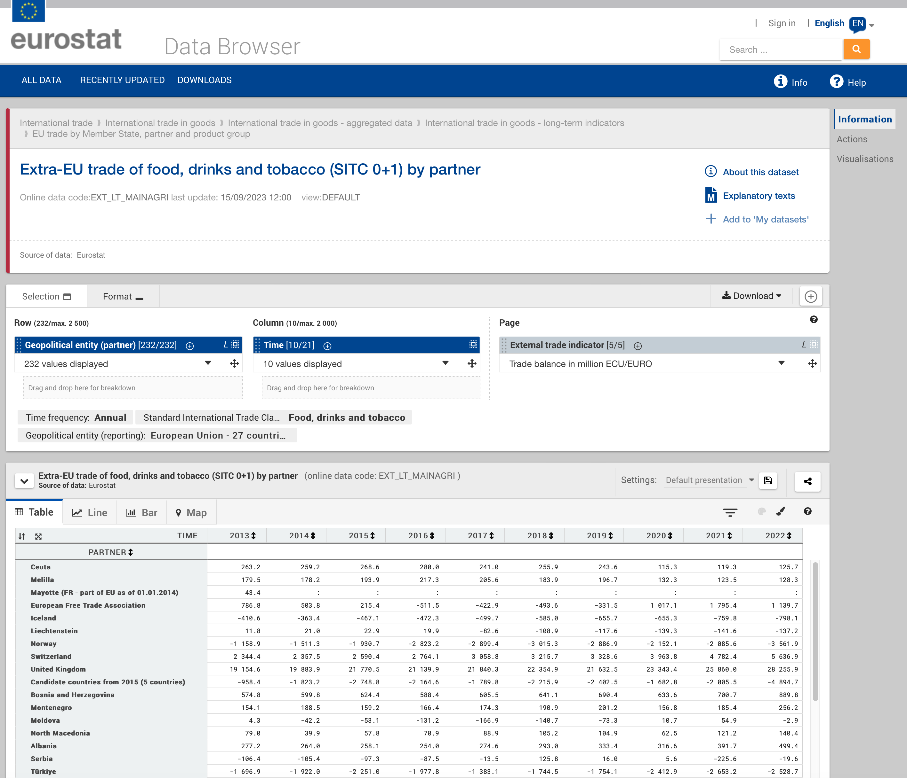

```{r setup, echo = FALSE, purl = FALSE, cache = FALSE, include=FALSE}
library(datasets)
knitr::opts_knit$set(global.par = TRUE)
knitr::opts_chunk$set(warning=FALSE, collapse=TRUE,dpi=300)
```

## Источники данных

- __Евростат__ (https://ec.europa.eu/eurostat/web/main/home), 
- __NASA POWER__ (https://power.larc.nasa.gov/)
- __USDA NRCS Soil Data Access__ (https://sdmdataaccess.nrcs.usda.gov/)

```{r}
library(dplyr)
library(tidyr)
library(ggplot2)
library(eurostat)
library(nasapower)
library(soilDB)
```

> Пакет soilDB лучше устанавливать из консоли командой `install.packages('soilDB', dependencies = TRUE)`. Указание параметра `dependencies = TRUE` обеспечит установку других пакетов, от которых он зависит.

---

## Коды Евростата {#advgraphics_eurostat}

Например, [таблица данных по продуктам питания, напиткам и табаку](https://ec.europa.eu/eurostat/databrowser/view/tet00034/default/table?lang=en) имеет код __tet00034__:

```{r, echo = FALSE}

```

---

## Загрузка данных Евростата {#advgraphics_eurostat}

```{r, cache = TRUE}
tables = c('tet00034', 'tet00033', 'tet00032', 
           'tet00031','tet00030', 'tet00029')

trades = lapply(tables, function(X) { # прочтем несколько таблиц в список
  get_eurostat(X) |>  label_eurostat() #<<
}) |> 
  bind_rows() |>  # объединим прочитанные таблицы в одну
  select(-geo) |>  # убираем столбец с территорией торговли
  filter(stringr::str_detect(indic_et, 'Exports in|Imports in')) |> 
  pivot_wider(names_from = indic_et, values_from = values)  |>
  rename(export = `Exports in million of ECU/EURO`,
         import = `Imports in million of ECU/EURO`) |> 
  mutate(partner = as.factor(partner))

trades
```

---

## Загрузка данных NASA POWER

```{r, eval=FALSE}
daily_single_ag <- get_power(
  community = "ag",
  lonlat = c(60.59, 56.84),
  pars = c("RH2M", "T2M"),
  dates = c("1995-04-01", "1995-04-30"),
  temporal_api = "daily"
)

daily_single_ag # посмотрим, что получилось
```

---

## Загрузка данных NASA POWER

```{r, eval = FALSE}
interannual_sse <- get_power(
  community = "SSE",
  lonlat = c(60.59, 56.84),
  dates = 1995:2015,
  temporal_average = "INTERANNUAL",
  pars = c("CLRSKY_SFC_SW_DWN",
           "ALLSKY_SFC_SW_DWN")
)
interannual_sse # посмотрим, что получилось
```

---

## Загрузка данных Soil Data Access

Результирющий объект представляет собой список со множеством таблиц, которые характеризуют как почвенную серию в целом, так и отдельные ее разрезы:
```{r, cache = TRUE}
soils = c('wilkes',  'chewacla', 'congaree')
series = fetchOSD(soils, extended = TRUE)
str(series)
```

---

## Быстрый график ggplot

Суммарный экспорт по годам с использованием `qplot()`:
```{r}
trades_total = trades |> 
  group_by(time) |> 
  summarise(export = sum(export),
            import = sum(import))
  
qplot(time, export, 
      data = trades_total, 
      geom = c('point', 'line'))
```

---

## Базовый шаблон ggplot

Базовый (минимально необходимый) шаблон построения графика через __ggplot__ выглядит следующим образом:
```{r, eval = FALSE}
ggplot(data = <DATA>) + 
  <GEOM_FUNCTION>(mapping = aes(<MAPPINGS>))
```
где:

- `DATA` --- источник данных (фрейм, тиббл)
- `GEOM_FUNCTION` --- функция, отвечающая за геометрический тип графика (точки, линии, гистограммы и т.д.)
- `MAPPINGS` --- перечень соответствий между переменными данных (содержащихся в `DATA`) и графическими переменными (координатами, размерами, цветами и т.д.)

---

## Геометрические типы

.pull-left[
Точки `geom_point()`:
```{r}
ggplot(data = trades_total) +
  geom_line(mapping = aes(x = time, y = export))
```
]

.pull-right[
Линии `geom_line()`:
```{r}
ggplot(data = trades_total) +
  geom_line(mapping = aes(x = time, y = export))
```
]


---

## Геометрические типы

.pull-left[
Ступенчатые кривые`geom_step()`:
```{r}
ggplot(data = trades_total) +
  geom_step(mapping = aes(x = time, y = export))
```
]

.pull-right[
Совмещение геометрий:
```{r}
ggplot(data = trades_total) +
  geom_line(mapping = aes(x = time, y = export)) +
  geom_point(mapping = aes(x = time, y = export))
```
]

---

## Геометрические типы

.pull-left[
Вынос общих данных:
```{r}
ggplot(data = trades_total, mapping = aes(x = time, y = export)) +
  geom_line() +
  geom_point()
```
]

.pull-right[
Заливка `geom_area()`:
```{r}
ggplot(data = trades_total, mapping = aes(x = time, y = export)) +
  geom_area(alpha = 0.5) + # полигон с прозрачностью 0,5
  geom_line() +
  geom_point()
```
]

---

## Геометрические типы

```{r}
df = trades |> filter(sitc06 == 'Machinery and transport equipment', 
                      time == as.Date('2017-01-01'))
```

.pull-left[
Столбчатая диаграмма:
```{r barplot, eval = F}
ggplot(
  df, 
  mapping = aes(
    x = partner, 
    y = export
  )
) +
  geom_col()
```
]

.pull-right[
```{r barplot-out, ref.label='barplot', echo=FALSE}
```
]

---

## Геометрические типы

.pull-left[
Перестановка осей через `coord_flip()`:
```{r flip, eval = FALSE}
ggplot(df, mapping = aes(x = partner, y = export)) +
  geom_col() +
  coord_flip()
```
]

.pull-right[
```{r flip-out, ref.label='flip', echo=FALSE}
```
]

---

## Графические переменные

Функция `aes(...)` управляет отображением переменных данных на графические переменные 
```{r}
# один цвет для графика (параметр за пределами aes)
ggplot(trades_total) + 
    geom_line(mapping = aes(x = time, y = export), color = 'blue')
```


---

## Графические переменные

```{r}
trade_russia = trades |> dplyr::filter(partner == 'Russia')
ggplot(trade_russia) + # у каждой группы данных свой цвет (параметр внутри aes)
  geom_line(mapping = aes(x = time, y = export, color = sitc06))
```

---

## Графические переменные

```{r}
ggplot(trade_russia, mapping = aes(x = time, y = export, color = sitc06)) + # а теперь и с точками
  geom_line() +
  geom_point()
```

---

## Графические переменные

Аналогичным образом работает параметр формы значка:
```{r}
# один значок для графика
ggplot(trades_total) + 
    geom_point(mapping = aes(x = time, y = export), shape = 15)
```

---

## Графические переменные

У каждой группы данных свой значок
```{r}
ggplot(trade_russia) + 
    geom_point(mapping = aes(x = time, y = export, shape = sitc06))
```

---

## Графические переменные

Управление размером через `size`:
```{r}
ggplot(trades_total, mapping = aes(x = time, y = export)) + 
    geom_point(size = 5) +
    geom_line(size = 2)
```

---

## Графические переменные

Группировка данных:
```{r}
ggplot(trade_russia, aes(x = time, y = export)) + 
    geom_point(aes(shape = sitc06)) +
    geom_line(aes(group = sitc06))
```

---

## Графические переменные

Управление цветом:
```{r}
ggplot(df, mapping = aes(x = partner, y = export)) +
  geom_col(fill = 'plum4', color = 'black', size = 0.2) +
  coord_flip()
```

---

## Графические переменные

Управление цветом:
```{r}
trades |> 
  dplyr::filter(time == as.Date('2017-01-01')) |> 
  ggplot(mapping = aes(x = partner, y = export, fill = sitc06)) +
  geom_col(color = 'black', size = 0.2) +
  coord_flip()
```

---

## Графические переменные

Процентное соотношение величин:
```{r}
trades |> 
  dplyr::filter(time == as.Date('2017-01-01')) |> 
  ggplot(mapping = aes(x = partner, y = export, fill = sitc06)) +
    geom_col(color = 'black', size = 0.2, position = 'fill') +
    coord_flip()
```

---

## Графические переменные

Группировка по соседству:
```{r}
trade_russia |> 
  dplyr::filter(time >= as.Date('2013-01-01')) |> 
  ggplot(mapping = aes(x = time, y = export, fill = sitc06)) +
    geom_col(color = 'black', size = 0.2, position = 'dodge')
```

---

## Системы координат

.pull-left[
Перестановка осей через `coord_flip()`:
```{r flip2, eval=F}
trades_type = trades |> 
  group_by(sitc06, time) |> 
  summarise(export = sum(export),
            import = sum(import))

ggplot(trades_type) + 
    geom_point(mapping = aes(x = export, y = import, color = sitc06, size = time), alpha = 0.5)

ggplot(trades_type) + 
    geom_point(mapping = aes(x = export, y = import, color = sitc06, size = time), alpha = 0.5) +
    coord_flip()
```
]

.pull-right[
```{r flip2-out, ref.label='flip2', echo=FALSE}
```
]

---

## Системы координат

.pull-left[
Логарифмирование:
```{r log, eval=F}
ggplot(
  trades_type, 
  mapping = aes(
    x = export, 
    y = import, 
    color = sitc06, 
    size = time
  )
) + 
  geom_point(alpha = 0.5) +
  scale_x_log10() +
  scale_y_log10()
```
]

.pull-right[
```{r log-out, ref.label='log', echo=FALSE}
```
]

---

## Системы координат

.pull-left[
Полярная система координат:
```{r log2, eval=F}
ggplot(
  df, 
  mapping = aes(
    x = partner, 
    y = export, 
    fill = partner
  )
) +
  geom_col() +
  coord_polar()
```
]

.pull-right[
```{r log2-out, ref.label='log2', echo=FALSE}
```
]

---

## Системы координат

.pull-left[
Преобразование квадратного корня:
```{r log3, eval=F}
ggplot(
  df, 
  mapping = aes(
    x = partner, 
    y = export, 
    fill = partner
  )
) +
  geom_col() +
  coord_polar() +
  scale_y_sqrt()
```
]

.pull-right[
```{r log3-out, ref.label='log3', echo=FALSE}
```
]

---

## Системы координат

.pull-left[
Классическая секторная диаграмма:
```{r polar2, eval=F}
ggplot(
  df, 
  mapping = aes(
    x = '', 
    y = export, 
    fill = partner
  ),
  color = 'black', 
  size = 0.2
) +
  geom_col() +
  coord_polar(theta = 'y')
```
]

.pull-right[
```{r polar2-out, ref.label='polar2', echo=FALSE}
```
]

---

## Названия осей и легенды

.pull-left[
```{r axes, eval=F}
options(scipen = 999)
ggplot(trades_type) + 
  geom_point(
    mapping = aes(
      x = export, 
      y = import, 
      color = sitc06, 
      size = time
    ),
    alpha = 0.5
  ) +
  labs(color = "Вид продукции", size = 'Год') +
  ggtitle('Соотношение импорта и экспорта в странах Евросоюза (млн долл. США)',
          subtitle = 'Данные по ключевым партнерам') +
  xlab('Экспорт') +
  ylab('Импорт')
```
]

.pull-right[
```{r axes-out, ref.label='axes', echo=FALSE}
```
]

---

## Разметка осей

.pull-left[
```{r axes2, eval=F}
brks = seq(0, 500000, 100000)
ggplot(
  trades_type, 
  mapping = aes(
    x = export, 
    y = import, 
    color = sitc06, 
    size = time
  )
) + 
  geom_point(alpha = 0.5) +
  scale_x_log10(
    breaks = brks,
    labels = brks / 1000
  ) +
  scale_y_log10(
    breaks = brks,
    labels = brks / 1000
  )
```
]

.pull-right[
```{r axes2-out, ref.label='axes2', echo=FALSE}
```
]

---

## Разметка осей

.pull-left[
Диапазоны по осям и выделение
```{r ranges, eval=F}
ggplot(
  trades_type, 
  mapping = aes(
    x = export, 
    y = import, 
    color = sitc06, 
    size = time
  )
) + 
  geom_point(alpha = 0.5) +
  lims(color = 'Machinery and transport equipment') +
  xlim(0, 75000) +
  ylim(0, 75000)
```
]

.pull-right[
```{r ranges-out, ref.label='ranges', echo=FALSE}
```
]

---

## Подписи и аннотации

.pull-left[
Подписи:
```{r labels, eval=F}
ggplot(
  data = trades_total, 
  mapping = aes(x = time, y = export)) +
  geom_area(alpha = 0.5) + # полигон с прозрачностью 0,5
  geom_line() +
  geom_point() +
  geom_text( # добавляем подписи
    aes(label = floor(export / 1000)), 
    vjust = 0, nudge_y = 40000
  )
```
]

.pull-right[
```{r labels-out, ref.label='labels', echo=FALSE}
```
]

---

## Подписи и аннотации

.pull-left[
Подписи с фоновой плашкой:
```{r labels2, eval=F}
ggplot(df, mapping = aes(x = partner, y = export)) +
  geom_col(fill = 'plum4', color = 'black', size = 0.2) +
  coord_flip() +
  geom_label(aes(y = export / 2, label = floor(export / 1000))) # добавляем подписи
```
]

.pull-right[
```{r labels2-out, ref.label='labels2', echo=FALSE}
```
]

---

## Подписи и аннотации

.pull-left[
__Аннотации__ представляют собой объекты, размещаемые на графике вручную:
```{r anno, eval=F}
ggplot(trades_total, 
       mapping = aes(x = time, y = export)) +
  geom_area(alpha = 0.5) + # полигон с прозрачностью 0,5
  geom_line() +
  geom_point() +
  geom_text(aes(label = floor(export / 1000)), 
            vjust = 0, nudge_y = 40000) +
  annotate("text", x = as.Date('2009-01-01'), 
           y = 550000, label = "Это провал", 
           color = 'red')
```
]

.pull-right[
```{r anno-out, ref.label='anno', echo=FALSE}
```
]

---

## Подписи и аннотации

.pull-left[
Аннотирование регионов:
```{r anno2, eval=F}
ggplot(trades_type, mapping = aes(x = export, y = import, color = sitc06, size = time)) + 
  annotate("rect", xmin = 100000, xmax = 250000, ymin = 75000, ymax = 175000,  alpha = .2, color = 'black', size = 0.1) +
  geom_point(alpha = 0.5) +
  annotate("text", x = 175000, y = 190000, label = "Chemicals", color = 'coral')
```
]

.pull-right[
```{r anno2-out, ref.label='anno2', echo=FALSE}
```
]

---

## Фасеты

```{r facets, eval=F}
brks = c(0, 50, 100, 150, 200)
trades |> 
  dplyr::filter(sitc06 == 'Machinery and transport equipment') |> 
  ggplot(mapping = aes(x = partner, y = import)) +
  geom_col() +
  scale_y_continuous(breaks = brks * 1e3, labels = brks) +
  ggtitle('Импорт продукции машиностроения (мдрд долл. США)',
        subtitle = 'Данные по ключевым партнерам') +
  coord_flip() +
  facet_wrap(~time)
```

.pull-right[
```{r facets-out, ref.label='facets', echo=FALSE}
```
]

---

## Темы

.pull-left[
```{r themes, eval=F}
ggplot(data = trades_total, mapping = aes(x = time, y = export)) +
  geom_area(alpha = 0.5) + # полигон с прозрачностью 0,5
  geom_line() +
  geom_point() +
  geom_text(aes(label = floor(export / 1000)), 
            vjust = 0, nudge_y = 40000) +
  theme_bw()
```
]

.pull-right[
```{r themes-out, ref.label='themes', echo=FALSE}
```
]