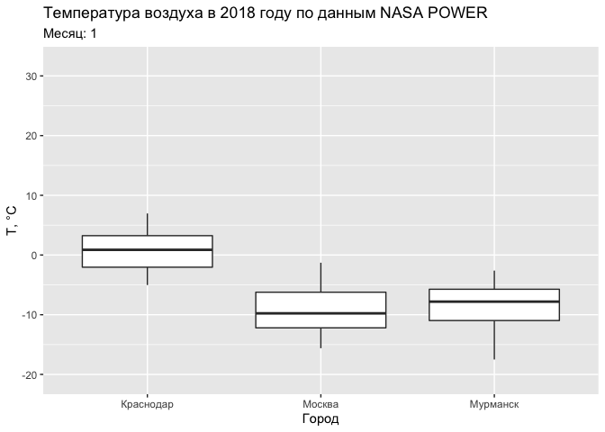
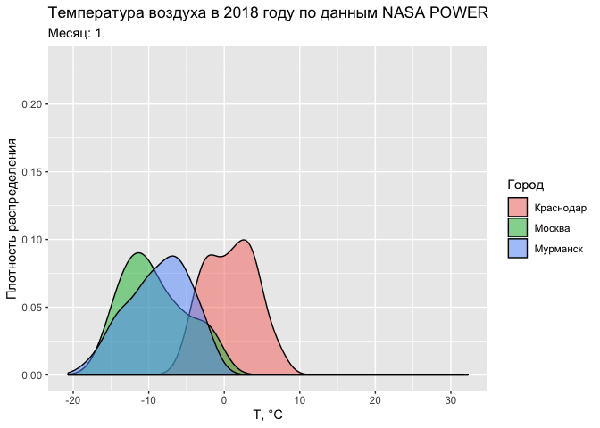
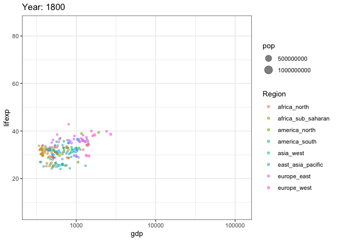

```{r setup, echo = FALSE, purl = FALSE, cache = FALSE, include=FALSE}
library(datasets)
knitr::opts_knit$set(global.par = TRUE)
knitr::opts_chunk$set(warning=FALSE, collapse=TRUE, message = FALSE, dpi=300)
```

## Используемые пакеты:

.pull-left[
__tidyverse__
```{r}
# tidyverse
library(ggplot2)
library(dplyr)
library(tidyr)
library(readr)
library(readxl)
library(googlesheets4)
```

__Данные__
```{r}
library(tsibbledata)
library(nasapower)
```

]

.pull-right[
__Временные данные__
```{r}
# пакеты для временных данных
library(gganimate)
library(lubridate)
library(zoo)
library(trend)
# library(tsibble)
# library(feasts)
# library(fable)
```
]


---

## Основные аспекты работы с временными рядами

1. Типы данных времени
2. Структуры данных для временных рядов
3. Преобразования времени и временных рядов
4. Декомпозиция временных рядов
5. Анализ трендов и автокорреляции
6. Построение моделей и прогнозирование
7. Визуализация и анимация


---

## Создание и преобразование дат и времени

Текущее время и дата:

```{r}
(date = Sys.Date())
(time = Sys.time())
```

Полученные объекты имеют типы `Date` и `POSIXct`:
```{r}
class(date)
class(time)
```

---

## Система счета времени

Время `POSIXct` хранится в целочисленном формате и отсчитывается начиная с начала эпохи UNIX — $1$ января $1970$ года по гринвичскому (_UTC_) времени:

```{r}
as.integer(date)
difftime(date, as.Date('1970-01-01'))

as.integer(time)
difftime(time, as.POSIXct('1970-01-01 00:00:00', tz = 'UTC'), units = 'secs')
```

---

## Работа с данными в lubridate

__Создание__ дат возможно на основе целочисленных и строковых значений:
```{r}
ymd(20150515)
dmy('15052015')
```

Для создания отметки времени необходимо сформировать строку, которая может быть интерпретирована должным образом. Часовой пояс указывается в `tz`:
```{r}
ymd_hms('2015-05-15 22:15:34') # по умолчанию Гринвичское время
ymd_hms('2015-05-15 22:15:34', tz = "Europe/Moscow")
```

---

## Работа с данными в lubridate

.pull-left[
__Извлечение__ компоненты даты/времени:
```{r}
year(time)
month(time)
week(time)
day(time)
hour(time)
second(time)
```

> Недели отсчитываются от начала года, а не месяца.

]

.pull-right[
__Замена__ компонент даты/времени:
```{r}
year(time) = 2015
month(time) = 01
time
```

__Округление__ даты/времени. Например, получить первый день в текущем году можно так:
```{r}
floor_date(Sys.Date(), 
           unit = 'year')
```
]
 
---

## Работа с данными в lubridate

__Периоды__  (_periods_) — это промежутки дат с точностью до _дня_. С помощью периода можно, например, к дате прибавить 1 год, 4 месяца, 3 недели и 2 дня:
```{r}
date
date + years(1) + months(4) + weeks(3) + days(2)
```

__Длительности__ (_durations_) — это промежутки времени с точностью до _секунды_. Работают они в целом аналогично периодам:
```{r}
dweeks(1)
time
time + dweeks(1)
time + weeks(1)
```

---

## Работа с данными в lubridate

__Интервалы__ — это отрезки между двумя датами. Интервал можно преобразовывать в периоды и длительности:
```{r}
int = interval(Sys.time(), time)
int
as.period(int, 'days')
as.duration(int)
```

---

## Восстановление пропусков

В качестве источника данных будем использовать данные об уровне воды на гидропосте Паялка (р. Умба, Мурманская область) с 1932 по 2014 год. Отсутствие информации в файле данных закодировано числом `9999`:
```{r}
src = read_delim('../r-geo-course/data/in_Umba.txt', delim = ' ', 
      col_names = c('day', 'month', 'year', 'level'), na = '9999')
head(src)
```

---

## Восстановление пропусков

Сформируем даты на основе первых трёх столбцов и проверим, все ли из них корректны. Если компоненты даты некорректны, то функция `yms()` вернет `NA`:

.left-60[
```{r}
tab = src |>
    mutate(Date = ymd(paste(year, 
                            month, 
                            day)))
tab |> 
  filter(is.na(Date))

tab = tab |> 
  filter(!is.na(Date))
```
]

.right-40[
<br>
Проверка показала, что преобразование в дату оказалось невозможно только для одной строки. В этой строке оператором была введена несуществующая дата — 29 февраля 1941 года. 

Для дальнейшей работы необходимо избавиться от некорректных дат.
]

---

## Восстановление пропусков

Упорядочим таблицу по возрастанию дат и используем функцию `lag()` из пакета __dplyr__, чтобы вычислить разницу между каждой датой и ее предшественницей. 
После этого отфильтруем строки, которым предшествует 1 или более пропущенных дней и сформируем отчетную таблицу, содержащую все найденные пропуски:
```{r}
tab |> 
  arrange(Date) |> 
  mutate(Gap = Date - lag(Date, 1) - 1) |> 
  filter(Gap > 0) |> 
  transmute(start_date = Date - Gap,
            end_date = Date - 1,
            duration = Gap)
```

---

## Восстановление пропусков

Чтобы восстановить пропущенные сроки, воспользуемся функцией `complete()` из пакета __tidyr__:
```{r}
tab_compl = tab |> 
  complete(Date = seq(min(Date, na.rm = T), 
                      max(Date, na.rm = T), by = 'day'))
```

Полная процедура проверки корректности и восстановления пропущенных дат:
```{r}
tab_compl = src |>
  mutate(Date = ymd(paste(year, month, day))) |> 
  filter(!is.na(Date)) |> 
  complete(Date = seq(min(Date, na.rm = T), 
                      max(Date, na.rm = T), by = 'day'))
```

---

## Интерполяция по времени

Одна из распространенных задач при работе с временными данными — это интерполяция по времени. Во-первых, интерполяция может использоваться для заполнения пропусков данных. Во-вторых, необходимость в интерполяции возникает когда неравномерно распределенные по времени данные надо перенести на регулярные сроки (скажем, через час), чтобы обеспечить их сравнимость с другими рядами данных. Заметим, что и в том и в другом случае необходимо учитывать _автокорреляционные свойства_ временного ряда и с осторожностью подходить к интерполяции на длительных промежутках времени, поскольку такая интерполяция может не иметь под собой физических оснований.

---

## Заполнение пропусков

Создание таблицы пропусков:
```{r}
timerep = tab_compl |> 
  mutate(type = if_else(is.na(level), 'gap', 'data'),
         num = with(rle(type), rep(seq_along(lengths), lengths))) |> 
  group_by(num) |> 
  summarise(start_date = min(Date),
            end_date = max(Date),
            duration = end_date - start_date + 1,
            type = first(type))
head(timerep, 3)
```

---

## Заполнение пропусков

```{r, echo = FALSE}
DT::datatable(timerep, height = 500)
```

---

## Автокорреляция

Критическую длину пропуска, заполняемого интерполяцией, можно связать с пороговым значением __автокорреляции__ — коэффициента корреляции исходного ряда данных и его копии, полученной со сдвигом $\tau$.
<br><br>
Для вычисления автокорреляционной функции (АКФ) найдем сначала максимальный период непрерывных наблюдений:
```{r}
(max_period = filter(timerep, type == 'data', duration == max(duration)))
```

---

## Автокорреляция

После этого отфильтруем данные на найденный период и вычислим АКФ, используя встроенную в базовый __R__
функцию `acf()`:

.pull-left[
.code-small[
```{r acf, eval=F}
autocorr = tab_compl |> 
  filter(
    between(
      Date, 
      max_period$start_date, 
      max_period$end_date
    )
  ) |> 
  pull(level) |> 
  acf(main = 'ACF')

max_dur = purrr::detect_index(
  autocorr$acf, ~ .x < 0.7
)

abline(h = 0.7, col='blue', lwd=2)
abline(v = max_dur, col='red', lwd=3)
```
]

]

.pull-right[
```{r acf-out, echo=F, ref.label='acf'}
```
]

---

## Интерполяция по времени

Для выполнения интерполяции воспользуемся функцией `na.approx()` из пакета __zoo__ и округлим полученные значения до одного знака после запятой (что соответствует точности исходных данных):
```{r}
(tab_interp = tab_compl |> 
  mutate(level_interp = zoo::na.approx(level, maxgap = max_dur) |> round(1)))
```

---

## Анализ пропусков

В заключение проведем заново оценку ситуации с пропусками в данных
```{r}
timerep_interp = tab_interp |> 
  mutate(type = if_else(is.na(level_interp), 'gap', 'data'),
         num = with(rle(type), rep(seq_along(lengths), lengths))) |> 
  group_by(num) |> 
  summarise(start_date = min(Date),
            end_date = max(Date),
            duration = end_date - start_date + 1,
            type = first(type))

head(timerep_interp)
```

---

## Анализ пропусков

```{r, echo = FALSE}
DT::datatable(timerep_interp, height = 500)
```

---

## Пересчет на другую временную сетку

Загрузим в качестве примера данные по метеостанции __NETATMO__:
```{r}
tab = read_csv('../r-geo-course/data/70_ee_50_00_8e_1a.csv')
```
```{r echo = F}
DT::datatable(tab, height = 400, options = list(scrollX = TRUE))
```


---

## Пересчет на другую временную сетку

Определим расчетные интервалы, кратные 30 минутам:
```{r}
(time_bounds = tibble(
  type = c('temperature', 'humidity', 'pressure'),
  tmin = ceiling_date(c(min(tab$time_temperature), 
                        min(tab$time_humidity), 
                        min(tab$time_pressure)), unit = '30 minutes'),
  tmax = floor_date(c(max(tab$time_temperature), 
                      max(tab$time_humidity), 
                      max(tab$time_pressure)),   unit = '30 minutes')
))
```

---

## Пересчет на другую временную сетку

Проинтерполуруем данные на единую регулярную временную сетку через $30$ минут, используя функцию [`approx()`](https://stat.ethz.ch/R-manual/R-devel/library/stats/html/approxfun.html) из базового __R__:
```{r}
time_interp = tibble(
  datetime = seq(min(time_bounds$tmin), 
                 max(time_bounds$tmax), 
                 by = '30 min'),
  temp = round(approx(tab$time_temperature, 
                      tab$temperature, 
                      xout = datetime)$y, 1),
  humd = round(approx(tab$time_humidity, 
                      tab$humidity, 
                      xout = datetime)$y, 1),
  pres = round(approx(tab$time_pressure, 
                      tab$pressure, 
                      xout = datetime)$y, 1)
)
```

---

## Пересчет на другую временную сетку

```{r, echo=F}
DT::datatable(time_interp, height = 500)
```


---

## Обеспеченность данными

Задачу поиска временного интервала исходных данных, в который попадает каждый интерполируемый временной срез, удобно решить с помощью кусочно-линейной функции [`stepfun()`](https://www.rdocumentation.org/packages/stats/versions/3.6.1/topics/stepfun) с параметрами:

- $X$ — упорядоченные по времени сроки исходных данных
- $Y$ — порядковые номера исходных сроков:

```{r}
src_time = sort(tab$time_temperature)
(tempfun = stepfun(src_time, 0:nrow(tab)))
```

Созданная усочно-линейная функция для переданного значения времени будет возвращать порядковый номер временного интервала исходных данных. 

---

## Обеспеченность данными

Оценим с помощью нее временные расстояния до ближайших наблюдений и их соответствие критериям:

- Время до ближайшего наблюдения не более 30 минут
- Длина интервала не более 90 минут

```{r}
timediff = lapply(time_interp$datetime, function(time) {
  idx = tempfun(time)
  tibble(datetime = time,
         temp_before = time - src_time[idx],
         temp_after = src_time[idx + 1] - time,
         temp_valid = min(temp_before, temp_after) <= minutes(30) &&
                          temp_before + temp_after <= minutes(90))
}) |> 
  bind_rows()
```


---

## Обеспеченность данными

```{r, echo=F}
DT::datatable(timediff, height = 500)
```

---

## Обеспеченность данными

```{r}
summary(timediff)
```

Полученные результаты говорят нам о том, что критериям соответствуют $1455$ значений температур из $2049$.

---

## Обеспеченность данными

Присоединим полученную информацию к таблице интерполированных значений:
```{r}
time_interp_checked = left_join(time_interp, timediff, by = 'datetime')
```

```{r, echo=FALSE}
DT::datatable(time_interp_checked, height = 350, options = list(scrollX = TRUE))
```

---

## Аппроксимация по времени

В качестве примера возьмем данные межгодичных изменений характеристик стока реки Мезень на посту Малонисогорская:

```{r}
(tab = read_csv('../r-geo-course/data/Mezen.csv'))
```

---

## Аппроксимация по времени

Построим график межгодичной изменчивости объема грунтового стока (переменная `Wgr` в $км^3$). Для того чтобы нанести линию глобального тренда, добавим грамматику `geom_smooth(method = 'lm')`:

.pull-left[
.code-small[
```{r wgr, eval = F}
ggplot(
  tab, 
  mapping = aes(Year1, Wgr)
) +
  geom_line() +
  geom_area(alpha = 0.5) +
  geom_smooth(method = 'lm') +
  labs(
    title = 'Объем грунтового стока',
    x = 'Год',
    y = expression(км^3)
  )
```
]
]

.pull-right[
```{r wgr-out, ref.label='wgr', echo=F, fig.height=5}
```
]

---

## Аппроксимация по времени

Добавим линию локальной регрессии `geom_smooth(method = 'loess')`:

.pull-left[
.code-small[
```{r wgr2, eval = F}
ggplot(
  tab, 
  mapping = aes(Year1, Wgr)
) +
  geom_line() +
  geom_area(alpha = 0.5) +
  geom_smooth(method = 'lm') +
  geom_smooth(
    method = 'loess',
    color = 'orangered', 
    span = 0.2
  ) +
  labs(
    title = 'Объем грунтового стока',
    x = 'Год',
    y = expression(км^3)
  )
```
]
]

.pull-right[
```{r wgr2-out, ref.label='wgr2', echo=F, fig.height=7}
```
]

---

## Локальная регрессия

.red[Метод __локальной регрессии__ изначально был разработан для построения кривых регрессии в случае когда зависимость между переменными ведет себя сложным образом и не может быть описана в терминах традиционной линейной и нелинейной регрессии — глобальных методов.]

.pull-left[
<br>
.small[.blue[Область значений независимой переменной $X$ можно покрыть конечным числом отрезков, для каждого из которых далее находят регрессию традиционным методом — как правило, линейную или квадратичную. Данный метод получил название _LOWESS (Locally weighted scatterplot smoothing)_. В дальнейшем эта аббревиатура была редуцирована до _LOESS_.]]
]

.pull-right[
```{r wgr2-out, ref.label='wgr2', echo=F, fig.height=5.5}
```
]

---

## Локальная регрессия

В классической постановке метод __LOESS__ реализуется следующим образом: 

- Пусть дано $n$ точек исходных данных с координатами $x$ (независимая переменная) и $y$ (зависимая). 

- Задается число $0 < \alpha \leq 1$, которое обозначает долю от общего количества точек $n,$ выбираемую в окрестности каждой точки для построения регрессии. 

- В абсолютном исчислении количество ближайших точек будет равно $r = [\alpha n]$, где $[\cdot]$ — округление до ближайшего целого.

Тогда вес, который будет иметь каждая $k$-я точка исходных данных в уравнении регрессии для $i$-й точки исходных данных будет определяться по формуле:

$$w_k (x_i) = W\big((x_k - x_i)h_i^{-1}\big),$$
где $h_i$ — расстояние до $r$-го по близости соседа точки $x_i$, а $W$ — весовая функция:

---

## Локальная регрессия

$$w_k (x_i) = W\big((x_k - x_i)h_i^{-1}\big)$$

1. $W(x) > 0$ если $|x| < 1$;
2. $W(-x) = W(x)$;
3. $W(x)$ невозрастающая функция для $x \geq 0$;
4. $W(x) = 0$ если $|x| \geq 1$.

Одним из стандартных вариантов весовой функции является _"трикубическая"_ функция, определяемая как:

$$
W(x) = \begin{cases}
(1 - |x|^3)^3, & \text{если } |x| < 1, \\
 0, & \text{если } |x| \geq 1.
\end{cases}
$$

Более близкие к $x_i$ точки оказывают большее влияние на коэффициенты регрессии. Помимо этого за пределами расстояния $h_i$ веса всех точек исходных данных будут обнуляться. 

---

## Локальная регрессия

Сглаженная оценка $\hat{y}_i$ в точке $x_i$ получается в виде полинома степени $d$:

$$\hat{y}_i = \sum_{j=0}^d \hat{\beta}_j (x_i) x_i^j,$$
где коэффициенты $\hat{\beta}_j$ находятся методом наименьших квадратов путем минимизации ошибки:

$$\sum_{k=1}^n w_k (x_i) (y_k - \beta_0 - \beta_1 x_k - ... - \beta_d x_k^d)^2$$
Процедура поиска коэффициентов регрессии повторяется для каждой из $n$ точек. 

---

## Локальная регрессия

В методе __LOESS__ используются степени регрессии $d = 0, 1, 2$. Кубические и более высокие степени полиномов на практике не применяются. 

> При степени равной 0 метод носит название _сглаживающего среднего_. 

Для построения линии локальной регрессии используйте функцию `geom_smooth()` без параметра `method` или с явным указанием параметра `method = 'loess'`:

Поведением локальной регрессии можно управлять, задавая параметры 

- `n` (количество ближайших точек $r$), 
- `span` (доля ближайших точек $\alpha$)
- `formula` (формула аппроксимируемой зависимости). 

По умолчанию используется регрессия первой степени (`formula = y ~ x`), значения `n = 80` и `span = 0.75`. 

---

## Локальная регрессия

Нанесем несколько кривых локальной регрессии, используя разный охват данных:

.pull-left[
.code-small[
```{r loess, eval=F}
ggplot(
  tab, 
  mapping = aes(Year1, Wgr)
) +
  geom_line() +
  geom_area(alpha = 0.5) +
  geom_smooth(color = 'yellow', 
              span = 0.1) +
  geom_smooth(color = 'orangered', 
              span = 0.2) +
  geom_smooth(color = 'darkred', 
              span = 0.4) +
  labs(
    title = 'Объем грунтового стока',
    x = 'Год',
    y = expression(км^3)
  )
```
]
]

.pull-right[
```{r loess-out, ref.label='loess', echo=F, fig.height=5.5}
```
]


---

## Статистики

При анализе временных рядов часто используются:

- Тест Манна-Кендалла на значимость линейного тренда
- Тест Петтитт на точку перелома
- Оценка величины тренда по методу Тейла-Сена

Эти тесты доступны в пакете __trend__:

.code-small[
```{r}
(mk = mk.test(tab$Wgr))
```
]


---

## Статистики

.code-small[
```{r}
(pt = pettitt.test(tab$Wgr))
(ts = sens.slope(tab$Wgr))
```
]


---

## Статистики

.pull-left[
.code-small[
```{r pt, eval=F}
ggplot(tab, aes(Year1, Wgr)) +
  geom_line() +
  geom_area(alpha = 0.5) +
  geom_smooth(method = 'lm') +
  geom_vline(
    xintercept = tab$Year1[pt$estimate], 
    color = "red", size = 0.5
  ) +
  annotate(
    "text", 
    label = tab$Year1[pt$estimate], 
    x = tab$Year1[pt$estimate] + 4, 
    y = max(tab$Wgr), 
    size = 4, colour = "red"
  ) +
  labs(
    title = 'Объем грунтового стока',
    x = 'Год',
    y = expression(км^3)
  )
```
]
]

.pull-right[
Для наглядности нанесем полученную точку перелома на график:
```{r pt-out, ref.label = 'pt', echo=F, fig.height=5}
```
]

---

## Анимация

Возможности анимаций в __gganimate__ реализуются посредством добавления новых грамматик к построенному графику __ggplot2__. К числу этих грамматик относятся:

- `transition_*()` — распределение данных по времени;
- `view_*()` — поведение осей координат во времени;
- `shadow_*()` — отображение данных, не относящихся к текущему временному срезу;
- `enter_*()/exit_*()` — характер появления/исчезновения данных в процессе анимации;
- `ease_aes()` — порядок смягчения (интерполяции) графических переменных в моменты перехода.

---

## Анимация

В качестве первого примера используем данные реанализа NASA POWER суточного осреднения, выгрузив информацию по точкам в трех городах (Мурманск, Москва, Краснодар) за 2018 год:
```{r, eval = FALSE}
cities = list(Мурманск = c(33, 69), 
              Москва = c(38, 56), Краснодар = c(39, 45))

tab = purrr::imap(cities, function(coords, city){
  get_power(
    community = "AG",
    lonlat = coords,
    pars = c("RH2M", "T2M", "PRECTOT"),
    dates = c("2018-01-01", "2018-12-31"),
    temporal_average = "DAILY"
  ) |> mutate(CITY = city,
               MONTH = month(YYYYMMDD))
}) |> bind_rows()
```

---

## Переход по времени

```{r, eval = FALSE}
ggplot(tab, aes(CITY, T2M)) +
  geom_boxplot() +
  labs(title = "Температура воздуха",
    subtitle = 'Месяц: {round(frame_time)}') + #<<
  xlab('Город') + ylab('Т, °С') +
  transition_time(MONTH) #<<
```

```{r, echo = FALSE, out.width='45%'}
# anim = ggplot(tab, aes(CITY, T2M)) +
#   geom_boxplot() +
#   labs(title = "Температура воздуха в 2018 году по данным NASA POWER",
#        subtitle = 'Месяц: {round(frame_time)}') +
#   xlab('Город') +
#   ylab('Т, °С') +
#   transition_time(MONTH)
# anim_save('images/boxplot_anim.gif',
#           animation = animate(anim))

```

---

## Переход по времени

.pull-left[
```{r, eval = FALSE}
ggplot(tab, aes(T2M, fill = CITY)) +
  geom_density(alpha = 0.5) + #<<
  labs(
    title = "Температура воздуха",
    subtitle = 'Месяц: {round(frame_time)}',
    fill = 'Город'
  ) +
  xlab('Т, °С') +
  ylab('Плотность распределения') +
  transition_time(MONTH)
```
]

.pull-right[
Плотность распределения:
```{r, echo = FALSE}
# anim = ggplot(tab, aes(T2M, fill = CITY)) +
#   geom_density(alpha = 0.5) +
#   labs(title = "Температура воздуха в 2018 году по данным NASA POWER",
#        subtitle = 'Месяц: {round(frame_time)}',
#        fill = 'Город') +
#   xlab('Т, °С') +
#   ylab('Плотность распределения') +
#   transition_time(MONTH)
# anim_save('images/density_anim.gif',
#           animation = animate(anim))

```
]

---

## Переход по времени

Данные Gapminder по соотношению продолжительности жизни и ВВП:
.code-small[
```{r, eval=FALSE}
countries = read_excel('../r-geo-course/data/gapminder.xlsx', 2) |>
  select(Country = name, Region = eight_regions) |>
  mutate(Country = factor(Country, levels = Country[order(.$Region)]))
# ВВП на душу населения
gdpdf_tidy = read_sheet('1cxtzRRN6ldjSGoDzFHkB8vqPavq1iOTMElGewQnmHgg') |> 
  pivot_longer(cols = `1764`:`2018`, names_to = 'year', values_to = 'gdp') |> 
  rename(Country = 1)
# численность населения
popdf_tidy = read_sheet('1IbDM8z5XicMIXgr93FPwjgwoTTKMuyLfzU6cQrGZzH8') |> 
  pivot_longer(cols = `1800`:`2015`, names_to = 'year', values_to = 'pop') |> 
  rename(Country = 1)
```
]

---

## Переход по времени

Данные Gapminder по соотношению продолжительности жизни и ВВП:

.code-small[
```{r, eval=FALSE}
# продолжительность жизни
lifedf_tidy = read_sheet('1H3nzTwbn8z4lJ5gJ_WfDgCeGEXK3PVGcNjQ_U5og8eo') |>
  pivot_longer(cols = `1800`:`2016`, names_to = 'year', values_to = 'lifexp') |> 
  rename(Country = 1)

tab = gdpdf_tidy |> 
  inner_join(lifedf_tidy) |> 
  inner_join(popdf_tidy) |> 
  inner_join(countries) |> 
  mutate(year = as.integer(year)) |> 
  drop_na()
```
]

---

## Переход по времени

.pull-left[
.code-small[
```{r, eval = FALSE}
options(scipen = 999)
ggplot(
  tab, aes(
    gdp, lifexp, 
    size = pop, 
    color = Region
  )
) +
  geom_point(alpha = 0.5) +
  scale_x_log10() +
  labs(title = 
       'Year: {round(frame_time)}') +
  theme_bw() +
  transition_time(year)
```
]
]

.pull-right[
```{r, echo=FALSE}
options(scipen = 999)
# anim = ggplot(tab, aes(gdp, lifexp, size = pop, color = Region)) +
#   geom_point(alpha = 0.5) +
#   scale_x_log10() +
#   labs(title = 'Year: {round(frame_time)}') +
#   theme_bw() +
#   transition_time(year)
# anim_save('images/scatter_anim.gif',
#           animation = animate(anim))

```
]


---

# Переход по состояниям

- В ряде случаев вместо перехода по времени целесообразно использовать __переход по состояниям__. В частности, такой подход оказывается удобен, когда сопоставляются данные за аналогичные временные срезы разных периодов. 


- Подобную стратегию можно использовать для визуализации изменений внутригодичного распределения величины между годами. 


- Чтобы обеспечить сопоставимость аналогичных дат за разные года, необходимо сохранить у них только месяц и день. 


- Поскольку такого формата даты не существует, в качестве "трюка" можно просто заменить года всех дат на $2000$ и записать результат в новое поле. 

---

# Переход по состояниям

Необходимые преобразования реализуются следующим образом:
```{r}
flt_tab = tab_interp |> 
  filter(!is.na(year)) |> 
  group_by(year) |>
  filter(!all(is.na(level_interp))) |> 
  ungroup() |> 
  mutate(yDate = Date)

# фиктивное поле, в котором аналогичные даты за разные года совпадают
year(flt_tab$yDate) <- 2000 
```

---

# Переход по состояниям

```{r, eval=FALSE}
anim = ggplot(flt_tab, mapping = aes(x = yDate, y = level_interp)) +
    geom_ribbon(aes(ymin = 0, ymax = level_interp), alpha = 0.5) +
    geom_line() +
    scale_x_date(date_breaks = "1 month", date_labels = "%b") +
    labs(title = "Расход воды на гидропосту Паялка",
         subtitle = 'Год: {closest_state}') +
    xlab('Дата') +
    ylab('куб.м/с') +
    theme(text = element_text(size = 18, family = 'Open Sans')) +
    transition_states(year, state_length = 0) + #<<
    view_follow(fixed_y = TRUE) #<<

animate(anim, 
        fps = 20,                                    # число кадров в секунду
        nframes = 10 * length(unique(flt_tab$year)), # общее число кадров
        width = 800, 
        height = 600)
```

---

# Переход по состояниям

```{r, echo=FALSE, out.width='65%'}
knitr::include_graphics('img/hydrograph_anim.gif')
```

> Текущий срез при выполнении анимации по состояниям доступен в переменной окружения `closest_state`.


