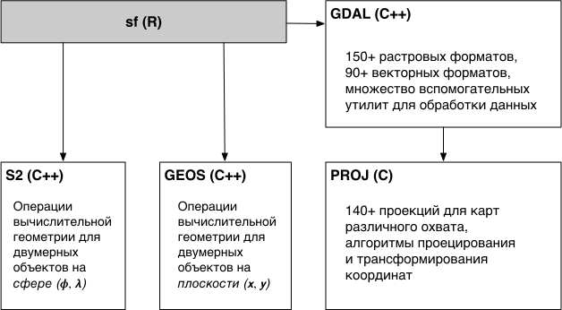

```{r setup, echo = FALSE, purl = FALSE, cache = FALSE, include=FALSE}
library(datasets)
knitr::opts_knit$set(global.par = TRUE)
knitr::opts_chunk$set(warning=FALSE, collapse=TRUE, message = FALSE, dpi=300)
```

## Используемые пакеты

__tidyverse__
```{r}
library(sf)
library(stars)
library(mapview)
library(dplyr)
library(readr)
```

---

## Модели пространственных данных

__Пространственный объект__ (feature) — это цифровая модель материального или абстрактного объекта реального или виртуального мира с указанием его идентификатора, координатных и атрибутивных данных

<br>
__Пространственные данные__ (spatial data) — это данные о пространственных объектах и их наборах. 

<br>

.pull-left[
.red[_Векторная модель_] пространственных данных представляет отдельные объекты путем координатного описания их границ, а также привязанных к ним характеристик — атрибутов.
]

.pull-right[
.blue[_Растровая модель_] пространственных данных представляет географическое пространство в виде непрерывного покрытия матрицей ячеек, к каждой из которых привязаны характеристики.
]

---

class: center, middle

# Векторные данные

---

## Simple Features

__Simple Features__ (официально _Simple Features Access_) — это стандарт [OGC 06-103](http://www.opengeospatial.org/standards/sfa), который определяет общую модель хранения и доступа к векторным объектам в географических информационных системах.

- Все геометрии состоят из точек. 
- Точки являются координатами в 2-, 3- или 4-мерном пространстве. 
- Все точки в геометрии имеют одинаковую размерность. 

В дополнение к обязательным измерениям $X$ и $Y$ _возможны_ два дополнительных:

- $Z$, обозначающее высоту
- $M$, обозначающее некоторую меру, связанную с точкой — например, время

Таким образом, существует 4 варианта геометрии: $XY$, $XYZ$, $XYM$ и $XYZM$.

В географических координатах $X$ соответствует долготе, $Y$ соответствует широте.

---

## Simple Features

Стандарт включает в себя 17 типов геометрий. Наиболее употребительны следующие.

<br>
.blue[__Простые геометрии__]

Тип |	Описание
----|--------------------------------------------------------------------------------
`POINT`	| нуль-мерная геометрия, содержащая одну точку
`LINESTRING` | последовательность точек, соединенных прямыми, несамопересекающимися отрезками; одномерная геометрия
`POLYGON`	| геометрия с положительной площадью (двумерная); последовательность точек, отрезки между которыми формируют замкнутое кольцо без самопересечений; первое кольцо является внешним, ноль и более остальных колец представляют дырки внутри полигона

---

## Simple Features

Стандарт включает в себя 17 типов геометрий. Наиболее употребительны следующие.

<br>
.red[__Мультигеометрии__]

Тип |	Описание
----|--------------------------------------------------------------------------------
`MULTIPOINT` | множество точек; геометрия типа `MULTIPOINT` называется _простой_ если ни одна пара точек в `MULTIPOINT` не совпадает
`MULTILINESTRING`	| множество линий
`MULTIPOLYGON`	| множество полигонов
`GEOMETRYCOLLECTION`	| множество геометрий произвольного типа за исключением `GEOMETRYCOLLECTION`

Оставшиеся виды геометрий _Simple Features_ включают: `CIRCULARSTRING`, `COMPOUNDCURVE`, `CURVEPOLYGON`, `MULTICURVE`, `MULTISURFACE`, `CURVE`, `SURFACE`, `POLYHEDRALSURFACE`, `TIN`, `TRIANGLE`.

---

## Simple Features

```{r, echo = FALSE}
p = st_point(c(0.5,0.5))

pc = rbind(c(0.5,0.5), c(1, 3), c(2, 1), c(0.2, 2), c(2, 3), c(1.5, 1.5))
mp = st_multipoint(pc)

s1 = rbind(c(0,1),c(0.5,1.5),c(1.2,1.2),c(2,1.3),c(3,2))
ls = st_linestring(s1)

s1 = rbind(c(0.5,1.5),c(1.2,1.2),c(2,1.3))
s2 = rbind(c(0,1.5),c(0.5,2.0),c(1.2,1.7))
s3 = rbind(c(2,1.8),c(3,2.5))
mls = st_multilinestring(list(s1,s2,s3))

p1 = rbind(c(0.5,0.5), c(2,0), c(3,2), c(1.5,4), c(0,3), c(0.5,0.5))
p2 = rbind(c(1,1), c(0.8,2), c(2,2.2), c(1.4,1.1), c(1,1))
pol = st_polygon(list(p1, p2))
p3 = rbind(c(3,3.3), c(3.5, 3.1), c(4,3), c(4,3.7), c(3.7, 3.96), c(3.2,4), c(3,3.3))
p4 = rbind(c(3.2,3.4), c(3.8,3.2), c(3.8,3.7), c(3.3,3.8), c(3.2,3.4))
p5 = rbind(c(3,1.2), c(2.5,0.2), c(3.5,0.2), c(3.5,1.2), c(3,1.2))
p6 = rbind(c(0,1), c(0.1,0.8), c(0.2,0.5), c(0.1,0.3), c(0, 0.7), c(0,1))
mpol = st_multipolygon(list(list(p1,p2), list(p3,p4), list(p5), list(p6)))

gc = st_geometrycollection(list(pol, mp + c(3, -1), mls + c(2.5,2)))
```

```{r, echo=FALSE,fig.width=16, fig.height=8, fig.show='hold'}
par(mfrow = c(2,3))
plot(p, cex = 5, pch = 20, main = 'POINT', cex.main=3)
plot(ls, lwd = 3, main = 'LINESTRING', cex.main=3)
plot(pol, lwd = 3, col = 'grey', main = 'POLYGON', cex.main=3)
plot(mp, cex = 5, pch = 20, main = 'MULTIPOINT', cex.main=3)
plot(mls, lwd = 3, main = 'MULTILINESTRING', cex.main=3)
plot(mpol, lwd = 3, col = 'grey', main = 'MULTIPOLYGON', cex.main=3)
# plot(gc, lwd = 3, col = 'grey', border = 'black', main = 'GEOMETRYCOLLECTION', cex.main=3)
par(mfrow = c(1,1))
```

---

## Форматы представления

.blue[__Well-Known Text (WKT)__] — текстовый формат (удобен для визуализации)

```{r, echo=FALSE, collapse=T}
cat(st_as_text(p))
cat(st_as_text(ls))
cat(st_as_text(pol))
cat(st_as_text(mp))
cat(st_as_text(mls))
cat(st_as_text(mpol))
cat(st_as_text(gc))
```

.red[__Well-Known Binary (WKB)__] — бинарный формат (предпочтителен для хранения)

```{r, echo=FALSE}
cat(st_as_binary(p))
cat(st_as_binary(ls))
cat(st_as_binary(pol))
cat(st_as_binary(mp))
cat(st_as_binary(mls))
cat(st_as_binary(mpol))
cat(st_as_binary(gc))
```

---

## Базовые библиотеки

.left-40[
В R существует высоко развитая инфраструктура для работы с векторными данными, которая обеспечивается пакетом [__sf__](https://cran.r-project.org/web/packages/sf/index.html).

<br>
__sf__ опирается на библиотеки [PROJ](https://proj.org), [GDAL](https://gdal.org), [GEOS](https://trac.osgeo.org/geos/) и [S2](https://s2geometry.io), которые устанавливаются вместе с ним.
]

.right-60[
```{r, echo=FALSE}

```
]

---

## Чтение

Для чтения данных средствами __sf__ необходимо использовать функцию `st_read()`:
```{r, collapse = TRUE}
countries = st_read('../r-geo-course/data/ne/countries.gpkg')
```

- Коллекция из 183 пространственных объектов с 72 атрибутами
- Тип геометрии `MULTIPOLYGON`, размерность геометрии $XY$
- Ограничивающий прямоугольник (разброс координат) по осям $X$ и $Y$ имеет диапазон $[-180, 180] \times [-90, 83.64513]$
- Проекция (CRS — coordinate reference system) имеет название _WGS 84_.

---

## Чтение

Подгрузим также для работы данные по другим типам объектов:
```{r}
oceans = st_read('../r-geo-course/data/ne/oceans.gpkg', quiet = TRUE)
rivers = st_read('../r-geo-course/data/ne/rivers.gpkg', quiet = TRUE)
lakes = st_read('../r-geo-course/data/ne/lakes.gpkg', quiet = TRUE)
cities = st_read('../r-geo-course/data/ne/cities.gpkg', quiet = TRUE)
```

> Параметр `quiet = TRUE` отключает вывод информации о загруженных данных.

---

## Внутренняя структура

Представление пространственных объектов типа Simple Features реализовано в виде иерархии из трех классов объектов:

1. `sf` (simple features) — объект класса `data.frame`, представляющий множество пространственных объектов со списком-колонкой для хранения геометрии.
1. `sfc` (simple features geometry column) — список-колонка в объекте `sf`, представляющий множество геометрий пространственных объектов.
1. `sfg` (simple feature geometry) — геометрия пространственного объекта внутри списка `sfc`.

Поскольку Simple Features реализованы в виде обычных фреймов данных, _любая операция, применимая к фрейму данных, будет также применима к объекту типа_ `sf`:

```{r}
class(countries)
```


---

## Внутренняя структура

Геометрия пространственных объектов хранится в одном из столбцов. В данном случае он имеет название `geometry`:
```{r, collapse = TRUE}
head(countries['geometry'])
```

---

## Внутренняя структура

Геометрический столбец можно извлечь, применив функцию `st_geometry()`. Полученный объект будет иметь тип __sfc__ (Simple Feature Geometry Column):

```{r, collapse = TRUE}
outlines = st_geometry(countries)
class(outlines)
head(outlines)
```

В данном случае объекты имеют класс `sfc_MULTIPOLYGON`, который является расширением класса `sfc` (simple feature geometry column).

---

## Внутренняя структура

.pull-left[
Поскольку объект класса `sfc` представляет собой список, любой элемент (отдельный объект) можно извлечь по его порядковому номеру:
```{r, results = 'asis'}
obj = outlines[[8]]
class(obj)
```

<br>
Геометрия 8-го объекта имеет класс `sfg`, реализованный в виде мультиполигонов (`MULTIPOLYGON`) с плоскими координатами (`XY`)
]

.pull-right[
Чтобы добраться до координат, необходимо развернуть иерархию списков, из которых состоит `sfg`:
```{r}
outlines[[8]][[1]]
```
]
