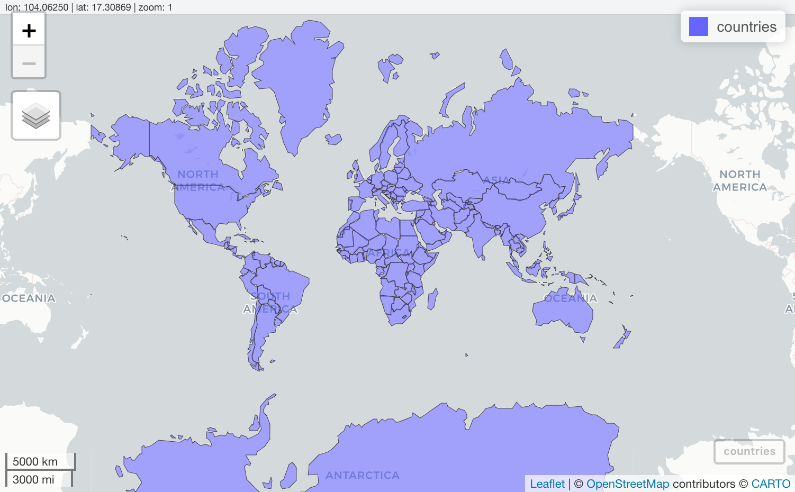
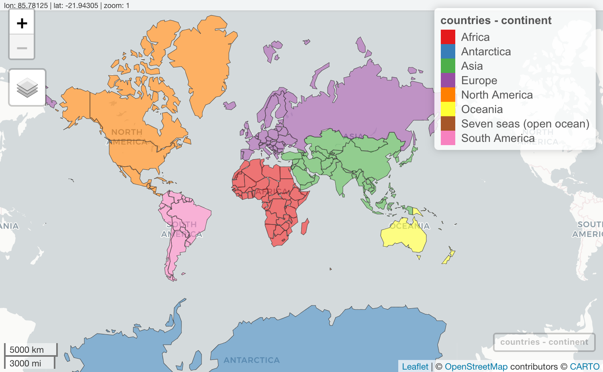
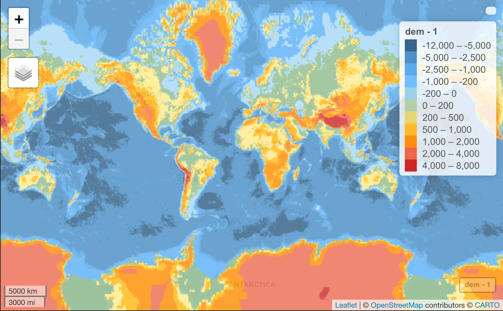

```{r setup, echo = FALSE, purl = FALSE, cache = FALSE, include=FALSE}
library(datasets)
knitr::knit_hooks$set(crop = knitr::hook_pdfcrop)
knitr::opts_knit$set(global.par = TRUE)
knitr::opts_chunk$set(warning=FALSE, collapse=TRUE, message = FALSE, dpi=300)
```

## Используемые пакеты

```{r}
library(sf)
library(stars)
library(mapview)
library(dplyr)
library(readr)
```

---

## Модели пространственных данных

__Пространственный объект__ (feature) — это цифровая модель материального или абстрактного объекта реального или виртуального мира с указанием его идентификатора, координатных и атрибутивных данных.

<br>
__Пространственные данные__ (spatial data) — это данные о пространственных объектах и их наборах. 

<br>

.pull-left[
.red[_Векторная модель_] пространственных данных представляет отдельные объекты путем координатного описания их границ, а также привязанных к ним характеристик — атрибутов.
]

.pull-right[
.blue[_Растровая модель_] пространственных данных представляет географическое пространство в виде непрерывного покрытия матрицей ячеек, к каждой из которых привязаны характеристики.
]

---

class: center, middle

# Векторные данные

---

## Simple Features

__Simple Features__ (официально _Simple Features Access_) — это стандарт [OGC 06-103](http://www.opengeospatial.org/standards/sfa), который определяет общую модель хранения и доступа к векторным объектам в географических информационных системах.

- Все геометрии состоят из точек. 
- Точки являются координатами в 2-, 3- или 4-мерном пространстве. 
- Все точки в геометрии имеют одинаковую размерность. 

В дополнение к обязательным измерениям $X$ и $Y$ _возможны_ два дополнительных:

- $Z$, обозначающее высоту
- $M$, обозначающее некоторую меру, связанную с точкой — например, время

Таким образом, существует 4 варианта геометрии: $XY$, $XYZ$, $XYM$ и $XYZM$.

В географических координатах $X$ соответствует долготе, $Y$ соответствует широте.

---

## Simple Features

Стандарт включает в себя 17 типов геометрий. Наиболее употребительны следующие.

<br>
.blue[__Простые геометрии__]

Тип |	Описание
----|--------------------------------------------------------------------------------
`POINT`	| нуль-мерная геометрия, содержащая одну точку
`LINESTRING` | последовательность точек, соединенных прямыми, несамопересекающимися отрезками; одномерная геометрия
`POLYGON`	| геометрия с положительной площадью (двумерная); последовательность точек, отрезки между которыми формируют замкнутое кольцо без самопересечений; первое кольцо является внешним, ноль и более остальных колец представляют дырки внутри полигона

---

## Simple Features

Стандарт включает в себя 17 типов геометрий. Наиболее употребительны следующие.

<br>
.red[__Мультигеометрии__]

Тип |	Описание
----|--------------------------------------------------------------------------------
`MULTIPOINT` | множество точек; геометрия типа `MULTIPOINT` называется _простой_ если ни одна пара точек в `MULTIPOINT` не совпадает
`MULTILINESTRING`	| множество линий
`MULTIPOLYGON`	| множество полигонов
`GEOMETRYCOLLECTION`	| множество геометрий произвольного типа за исключением `GEOMETRYCOLLECTION`

Оставшиеся виды геометрий _Simple Features_ включают: `CIRCULARSTRING`, `COMPOUNDCURVE`, `CURVEPOLYGON`, `MULTICURVE`, `MULTISURFACE`, `CURVE`, `SURFACE`, `POLYHEDRALSURFACE`, `TIN`, `TRIANGLE`.

---

## Simple Features

```{r, echo = FALSE}
p = st_point(c(0.5,0.5))

pc = rbind(c(0.5,0.5), c(1, 3), c(2, 1), c(0.2, 2), c(2, 3), c(1.5, 1.5))
mp = st_multipoint(pc)

s1 = rbind(c(0,1),c(0.5,1.5),c(1.2,1.2),c(2,1.3),c(3,2))
ls = st_linestring(s1)

s1 = rbind(c(0.5,1.5),c(1.2,1.2),c(2,1.3))
s2 = rbind(c(0,1.5),c(0.5,2.0),c(1.2,1.7))
s3 = rbind(c(2,1.8),c(3,2.5))
mls = st_multilinestring(list(s1,s2,s3))

p1 = rbind(c(0.5,0.5), c(2,0), c(3,2), c(1.5,4), c(0,3), c(0.5,0.5))
p2 = rbind(c(1,1), c(0.8,2), c(2,2.2), c(1.4,1.1), c(1,1))
pol = st_polygon(list(p1, p2))
p3 = rbind(c(3,3.3), c(3.5, 3.1), c(4,3), c(4,3.7), c(3.7, 3.96), c(3.2,4), c(3,3.3))
p4 = rbind(c(3.2,3.4), c(3.8,3.2), c(3.8,3.7), c(3.3,3.8), c(3.2,3.4))
p5 = rbind(c(3,1.2), c(2.5,0.2), c(3.5,0.2), c(3.5,1.2), c(3,1.2))
p6 = rbind(c(0,1), c(0.1,0.8), c(0.2,0.5), c(0.1,0.3), c(0, 0.7), c(0,1))
mpol = st_multipolygon(list(list(p1,p2), list(p3,p4), list(p5), list(p6)))

gc = st_geometrycollection(list(pol, mp + c(3, -1), mls + c(2.5,2)))
```

```{r, echo=FALSE,fig.width=16, fig.height=8, fig.show='hold'}
par(mfrow = c(2,3))
plot(p, cex = 5, pch = 20, main = 'POINT', cex.main=3)
plot(ls, lwd = 3, main = 'LINESTRING', cex.main=3)
plot(pol, lwd = 3, col = 'grey', main = 'POLYGON', cex.main=3)
plot(mp, cex = 5, pch = 20, main = 'MULTIPOINT', cex.main=3)
plot(mls, lwd = 3, main = 'MULTILINESTRING', cex.main=3)
plot(mpol, lwd = 3, col = 'grey', main = 'MULTIPOLYGON', cex.main=3)
# plot(gc, lwd = 3, col = 'grey', border = 'black', main = 'GEOMETRYCOLLECTION', cex.main=3)
par(mfrow = c(1,1))
```

---

## Форматы представления

.blue[__Well-Known Text (WKT)__] — текстовый формат (удобен для визуализации)

```{r, echo=FALSE, collapse=T}
cat(st_as_text(p))
cat(st_as_text(ls))
cat(st_as_text(pol))
cat(st_as_text(mp))
cat(st_as_text(mls))
cat(st_as_text(mpol))
cat(st_as_text(gc))
```

.red[__Well-Known Binary (WKB)__] — бинарный формат (предпочтителен для хранения)

```{r, echo=FALSE}
cat(st_as_binary(p))
cat(st_as_binary(ls))
cat(st_as_binary(pol))
cat(st_as_binary(mp))
cat(st_as_binary(mls))
cat(st_as_binary(mpol))
cat(st_as_binary(gc))
```

---

## Базовые библиотеки

.left-40[
В R существует высоко развитая инфраструктура для работы с векторными данными, которая обеспечивается пакетом [__sf__](https://cran.r-project.org/web/packages/sf/index.html).

<br>
__sf__ опирается на библиотеки [PROJ](https://proj.org), [GDAL](https://gdal.org), [GEOS](https://trac.osgeo.org/geos/) и [S2](https://s2geometry.io), которые устанавливаются вместе с ним.
]

.right-60[
```{r, echo=FALSE}
knitr::include_graphics('img/sf_architecture_new.svg')
```
]

---

## Чтение

Для чтения данных средствами __sf__ необходимо использовать функцию `st_read()`:
```{r, collapse = TRUE}
countries = st_read('../r-geo-course/data/ne/countries.gpkg')
```

- Коллекция из 183 пространственных объектов с 72 атрибутами
- Тип геометрии `MULTIPOLYGON`, размерность геометрии $XY$
- Ограничивающий прямоугольник (разброс координат) по осям $X$ и $Y$ имеет диапазон $[-180, 180] \times [-90, 83.64513]$
- Проекция (CRS — coordinate reference system) имеет название _WGS 84_.

---

## Чтение

Подгрузим также для работы данные по другим типам объектов:
```{r}
oceans = st_read('../r-geo-course/data/ne/oceans.gpkg', quiet = TRUE)
rivers = st_read('../r-geo-course/data/ne/rivers.gpkg', quiet = TRUE)
lakes = st_read('../r-geo-course/data/ne/lakes.gpkg', quiet = TRUE)
cities = st_read('../r-geo-course/data/ne/cities.gpkg', quiet = TRUE)
```

> Параметр `quiet = TRUE` отключает вывод информации о загруженных данных.

---

## Внутренняя структура

Представление пространственных объектов типа Simple Features реализовано в виде иерархии из трех классов объектов:

1. `sf` (simple features) — объект класса `data.frame`, представляющий множество пространственных объектов со списком-колонкой для хранения геометрии.
1. `sfc` (simple features geometry column) — список-колонка в объекте `sf`, представляющий множество геометрий пространственных объектов.
1. `sfg` (simple feature geometry) — геометрия пространственного объекта внутри списка `sfc`.

Поскольку Simple Features реализованы в виде обычных фреймов данных, _любая операция, применимая к фрейму данных, будет также применима к объекту типа_ `sf`:

```{r}
class(countries)
```


---

## Внутренняя структура

Геометрия пространственных объектов хранится в одном из столбцов. В данном случае он имеет название `geometry`:
```{r, collapse = TRUE}
head(countries['geometry'])
```

---

## Внутренняя структура

Геометрический столбец можно извлечь, применив функцию `st_geometry()`. Полученный объект будет иметь тип __sfc__ (Simple Feature Geometry Column):

```{r, collapse = TRUE}
outlines = st_geometry(countries)
class(outlines)
head(outlines)
```

В данном случае объекты имеют класс `sfc_MULTIPOLYGON`, который является расширением класса `sfc` (simple feature geometry column).

---

## Внутренняя структура

.pull-left[
Поскольку объект класса `sfc` представляет собой список, любой элемент (отдельный объект) можно извлечь по его порядковому номеру:
```{r, results = 'asis'}
obj = outlines[[8]]
class(obj)
```

<br>
Геометрия 8-го объекта имеет класс `sfg`, реализованный в виде мультиполигонов (`MULTIPOLYGON`) с плоскими координатами (`XY`)
]

.pull-right[
Чтобы добраться до координат, необходимо развернуть иерархию списков, из которых состоит `sfg`:
```{r}
outlines[[8]][[1]]
```
]

---

## Визуализация (базовая графика)

По умолчанию выполняется графический обзор атрибутов объектов
```{r}
plot(countries)
```

---

## Визуализация (базовая графика)

Если задача стоит нарисовать границы объектов, то нужно отображать объект __sfc__:
```{r, fig.width=9, fig.height=3}
plot(st_geometry(countries))
```

---

## Визуализация (базовая графика)

Для быстрого построения тематических карт по выбранному показателю необходимо при вызове функции `plot()` указать соответствующий атрибут фрейма данных:
```{r, fig.width=9, fig.height=3}
plot(countries['sovereignt'], key.pos = NULL) # Здесь легенда не нужна
```

---

## Визуализация (базовая графика)

Для отображения координатной сетки надо указать параметр `graticule = TRUE`, а подписей координат — `axes = TRUE`:
```{r, fig.width=9, fig.height=3}
plot(countries['gdp_md_est'], graticule = TRUE, axes = TRUE)
```

---

## Визуализация (базовая графика)

Для совмещения нескольких слоев на одной карте необходимо при втором и последующих вызовах функции `plot()` указать параметр `add = TRUE`. 

.pull-left[
.code-small[
```{r complot, eval=F}
cities_large = cities |> 
  filter(scalerank == 0, 
         ! name %in% c('Washington, D.C.', 'Paris', 'Riyadh', 'Rome', 'São Paulo', 'Kolkata'))
plot(st_geometry(countries), lwd = 0.5, 
     border = 'gray', xlim = c(-180,180))
plot(oceans, col = 'steelblue1', 
     border = 'steelblue', add = TRUE)
plot(lakes, col = 'steelblue1', 
     border = 'steelblue', add = TRUE)
plot(rivers, col = 'steelblue', 
     add = TRUE)
plot(cities_large, col = 'black', 
     pch = 19, cex = 0.25, add = TRUE)
text(cities_large$longitude, 
     cities_large$latitude, 
     label = cities_large$name, 
     cex = 0.5, pos = 2, offset = 0.25)
```
]
]

.pull-right[
```{r, ref.label='complot', echo=F, fig.width=5, fig.height=5, crop = TRUE}
par(mar = rep(0,4))
```
]

---

## Визуализация (интерактивная)

Для интерактивного исследования объектов можно использовать пакет `mapview`:
```{r, eval = FALSE}
mapview(countries)
```
```{r, echo = FALSE}

```

---

## Визуализация (интерактивная)

Отображение показателей цветом осуществляется через параметр `col.regions`:

```{r, eval = FALSE}
nconts = length(unique(countries$continent))
mapview(countries, zcol = 'continent', 
        col.regions = RColorBrewer::brewer.pal(nconts, 'Set1'))
```
```{r, echo = FALSE}

```

---

## Визуализация (интерактивная)

Несколько слоев складываются через `+` как в __ggplot2__:
.code-small[
```{r, eval=FALSE}
mapview(countries, zcol = 'continent', 
        col.regions = RColorBrewer::brewer.pal(nconts, 'Set1')) + #<<
  mapview(cities_large, col.regions = 'black', label = 'name', cex = 3) } |> 
  leafem::addStaticLabels(cities_large, label = cities_large$name,
                          offset = c(0.1, 0),
                          style = list("color" = "black", "font-weight" = "bold"))
```
]

```{r, echo = FALSE}
knitr::include_graphics('img/mapview3.png')
```

---

## Атрибутивные операции

К объектам `sf` применимы стандартные преобразования фреймов данных.

.pull-left[
__Италия__:
```{r, out.width = '250px', crop = T}
italy = countries |> 
  filter(sovereignt == 'Italy')
plot(st_geometry(italy))
```
]

.pull-right[
__Cтраны более 100 млн. жителей__:
```{r, out.width = '400px', crop = T}
largest = countries |> 
  select(pop_est) |> 
  filter(pop_est > 100000000)
plot(outlines, col = 'lightgrey')
plot(largest, col = 'red', add = TRUE)
```
]

---

## Атрибутивные операции

.pull-left[
__Валовой региональный продукт по континентам:__

```{r grp, eval = F}
continents = countries %>%
  filter(., st_is_valid(.)) |>
  group_by(continent) |>  
  summarise(gdp = sum(gdp_md_est))
plot(continents['gdp'])
```
]

.pull-right[
```{r, ref.label='grp', out.width = '400px', crop = T, echo = F}
```
]

---

## Геометрические объекты (sfg)

Для создания геометрических объектов класса `sfg` существует ряд функций:

Функция                   | Тип пространственного объекта
--------------------------|-----------------------------------
`st_point()`              | _POINT_
`st_linestring()`         | _LINESTRING_
`st_polygon()`            | _POLYGON_
`st_multipoint()`         | _MULTIPOINT_
`st_multilinestring()`    | _MULTILINESTRING_
`st_multipolygon()`       | _MULTIPOLYGON_
`st_geometrycollection()` | _GEOMETRYCOLLECTION_

<br><br><br><br><br><br><br><br><br><br><br>

В зависимости от типа создаваемого объекта, данные функции принимают координаты в виде вектора, матрицы или списка.

---

## Точки

Проще всего создаются отдельные __точки__ (_POINT_):
```{r, message = T}
st_point(c(0, 2)) # XY POINT
st_point(c(0, 2, -1)) # XYZ POINT
st_point(c(0, 2, 5), dim = 'XYM') # XYM POINT
st_point(c(0, 2, -1, 5)) # XYZM POINT
```

Дополнительный параметр `dim=` служит для уточнения типа геометрии точек и по сути нужен только тогда, когда необходимо создать редко используемые точки типа _XYM_. Во всех остальных случаях (_XY_, _XYZ_, _XYZM_) размерность геометрии распознается по умолчанию.

---

## Мультиточки и линии

При создании __мультиточек__ (`MULTIPOINT`) и __линий__ (`LINESTRING`) необходимо подавать на вход функции уже матрицу координат:
```{r, message = T}
coords = matrix(c(
  0, 2,
  1, 3,
  3, 1,
  5, 0
), ncol = 2, byrow = TRUE)

mp = st_multipoint(coords) # XY MULTIPOINT
print(mp)

ls = st_linestring(coords) # XY LINESTRING
print(ls)
```

---

## Мультиточки и линии

.pull-left[
В первом случае геометрия состоит из отдельных точек. Во втором случае те же самые точки соединены линией:
```{r pntline, eval=F}
plot(ls)
plot(mp, col = 'red', 
     pch = 19, add = TRUE)
```

> .small[Создание трех-(_XYZ_, _XYM_) и четырехмерных (_ZYXM_) мультиточек и линий выполняется аналогично, но матрица должна содержать не 2, а, соответственно 3 или 4 столбца, и при необходимости параметр `dim = 'XYM'`.]
]

.pull-right[
```{r ref.label='pntline', echo = F}
```
]

---

## Полигоны

Полигоны создаются на основе списков матриц координат.

.pull-left[
```{r, message = T}
# Координаты границы
coords = matrix(c(
  1, 0,
  0, 2,
  2, 3,
  4, 2,
  3, 0.5,
  1, 0
), ncol = 2, byrow = TRUE)

# Простой полигон без дырки
pol = st_polygon(list(coords))
print(pol)
```
]

.pull-right[
```{r, out.width='400px', crop = T}
plot(pol, col = 'lightblue')
```
]

---

## Полигоны

Вторая и последующие матрицы координат в списке определяют границы дырок.

.pull-left[
```{r, message = T}
# Координаты дырки
hole = matrix(c(
  2, 1,
  3, 1.5,
  3, 2,
  2, 2,
  1.5, 1.5,
  2, 1
), ncol = 2, byrow = TRUE)

# Полигон с дыркой
pol2 = st_polygon(list(coords, hole))
print(pol2)
```
]

.pull-right[
```{r, out.width='400px', crop = T}
plot(pol2, col = 'lightblue')
```
]

---

## Мультиполигоны

.pull-left[
```{r}
coords1 = matrix(c(
  0.5, 0,
  0, 1,
  1, 1.5,
  2, 1,
  1.5, 0.25,
  0.5, 0
), ncol = 2, byrow = TRUE)

coords2 = matrix(c(
  3, 1,
  2.5, 2,
  3.5, 2.5,
  4, 2,
  4, 1.25,
  3, 1
), ncol = 2, byrow = TRUE)
```
]

.pull-right[
Мультиполигоны (`MULTIPOLYGON`) и мультилинии (`MULTILINESTRING`) требуются, когда один географический объект состоит из нескольких геометрических объектов. В мультиполигонах добавляется еще один уровень вложенности списков.

```{r, message=T}
mpol = st_multipolygon(
  list(
    list(coords1), 
    list(coords2)
  )
)
print(mpol)
```
]

---

## Мультиполигоны

```{r, out.width='500px', crop=T}
plot(pol, col = 'grey') # Обычный полигон (серый)
plot(mpol, col = 'pink', add = TRUE) # Мультиполигон (розовый)
```

---

## Мультиполигоны

Пример из практики: остров на озере как часть суши.

.pull-left[
```{r, message = T}
coords4 = matrix(c(
  2.2, 1.2,
  2.8, 1.5,
  2.8, 1.8,
  2.2, 1.8,
  2.0, 1.6,
  2.2, 1.2
), ncol = 2, byrow = TRUE)

island = st_polygon(list(coords4))
mpol2 = st_multipolygon(
  list(pol2, island)
)
print(mpol2)
```
]

.pull-right[
```{r, crop = T}
plot(mpol2, col = 'olivedrab')
```
]

---

## Мультилинии

Мультилиния, в отличие от мультиполигона, не требует дополнительного списка верхнего уровня, поскольку линии не могут содержать дыр. Например, можно собрать мультилинию из двух частей, соответствующих участкам реки до и после озера:

.pull-left[
```{r, message=T}
coords1 = matrix(c(
  -3, 0,
  -1, 2,
  0, 2
), ncol = 2, byrow = TRUE)
coords2 = matrix(c(
  4, 2,
  5, 3,
  6, 5
), ncol = 2, byrow = TRUE)
mline = st_multilinestring(list(coords1, coords2))
print(mline)
```
]

.pull-right[
```{r, out.height='250px', crop=T}
plot(mline, lwd = 3, col = 'blue')
plot(pol2, col = 'lightblue', add = TRUE)
```
]

---

## Геометрические коллекции

Геометрическая коллекция (`GEOMETRYCOLLECTION`) позволяет хранить вместе любые виды геометрий. Коллекции редко создаются напрямую, чаще они получаются в результате выполнения геометрических операций типа оверлея.

```{r, message=T}
col = st_geometrycollection(list(ls, mp, mline, pol2))
print(col)
```

.pull-left[
```{r geomcol, eval=F}
plot(col)
```

]

.pull-right[
```{r, ref.label='geomcol', echo=F, out.height='200px', crop=T}
```

]

---

## Списки геометрических объектов (sfc)

Списки геометрических объектов (класс `sfc`) используются в таблицах пространственных объектов в качестве столбца, который хранит геометрию объектов.

```{r, message = T}
moscow.sfg = st_point(c(37.615, 55.752))
irkutsk.sfg = st_point(c(104.296, 52.298))
petro.sfg = st_point(c(158.651, 53.044))

cities.sfc = st_sfc(moscow.sfg, irkutsk.sfg, petro.sfg)
print(cities.sfc)
```

---

## Списки геометрических объектов (sfc)

При создании списка геометрий для него может быть определена система координат:

```{r}
st_crs(cities.sfc) = st_crs(4326) # WGS84
print(cities.sfc)
```

> Для списка геометрий может быть определена только одна система координат

---

## Списки геометрических объектов (sfc)

Куда легли созданные точки?

```{r, out.height = '250px', crop = T}
plot(cities.sfc, pch = 19)
countries |> 
  filter(sovereignt == 'Russia') |> 
  st_geometry() |>
  plot(add = TRUE)
```

---

## Пространственные объекты (`sf`)

Пространственные объекты (класс `sf`) организуются в виде фрейма данных, один из столбцов которого имеет класс `sfc`.

```{r}
city.attr = data.frame(
  name = c('Москва', 'Иркутск', 'Петропавловск-Камчатский'),
  established = c(1147, 1661, 1740), population = c(12500, 620, 180)
)
cites.sf = st_sf(city.attr, geometry = cities.sfc)
print(cites.sf)
```

---

## Точки по координатам

Для решения этой задачи можно воспользоваться функцией `st_as_sf()`. Рассмотрим задачу на примере файла координат станций из базы метеорологических данных [__ВНИИГМИ-МЦД__](http://meteo.ru/):

```{r}
stations = read_fwf(
  '../r-geo-course/data/vniigmi/stations.txt', 
  col_positions = fwf_widths(diff(c(1, 7, 42, 47, 53, 59, 67, 71)), 
  col_names = c('id', 'name', 'lat', 't1', 'lon', 't2', 'z')),
  locale = locale(encoding = 'CP1251')
)

print(stations)
```

---

## Точки по координатам

Теперь создадим пространственные точки на основе этой таблицы, взяв координаты из столбцов _lat_ и _lon_ соответственно и указав код системы координат:

.pull-left[
```{r vniigmi, eval=F}
sf_stations = st_as_sf(
  stations, 
  coords = c("lon", "lat"), 
  crs = 4326
)
plot(
  st_geometry(sf_stations), 
  pch = 19, col = 'red', 
  cex = 0.25
)
plot(
  st_geometry(countries), 
  border = 'grey', add = TRUE
)
box()
```
]

.pull-right[
```{r, ref.label='vniigmi', crop=T, out.height='450px', echo=F}
```
]

---

## Преобразование типа геометрии

Для преобразования типов геометрии существует функция `st_cast()`. Функция принимает объекты классов `sfg`, `sfc` или `sf`, а также название типа геометрии, к которому необходимо привести входные объекты.

```{r}
italy.borders = st_cast(italy, 'MULTILINESTRING')
class(st_geometry(italy.borders))

italy.regions = st_cast(italy.borders, 'MULTIPOLYGON')
class(st_geometry(italy.regions))

italy.points = st_cast(italy.borders, 'POINT')
class(st_geometry(italy.points))
```

---

## Преобразование типа геометрии

Для преобразования типов геометрии существует функция `st_cast()`. Функция принимает объекты классов `sfg`, `sfc` или `sf`, а также название типа геометрии, к которому необходимо привести входные объекты.

.pull-left[
```{r stcast, eval=F}
plot(
  st_geometry(italy.regions), 
  lwd = 0.5
)
plot(
  italy.points, 
  pch = 20, 
  add = TRUE
)
```
]

.pull-right[
```{r, ref.label='stcast', echo=F, crop = T, out.height='400px'}
```
]

---

## Полигонизация и разбиение линий

__Полигонизация__ — это процесс преобразования линии или мультилинии в полигон(ы). Может быть полезной если необходимо восстановить площади объектов на основе их границ.  На вход нужна _одна_ мультилиния:

.pull-left[
```{r}
# Создадим три линии
coords1 = rbind(c(0, 0), c(0, 6))
line1 = st_linestring(coords1)

coords2 = rbind(c(-1,1), c(5,1))
line2 = st_linestring(coords2)

coords3 = rbind(c(-1,5), c(4,0))
line3 = st_linestring(coords3)

# Создадим мультилинию
mls = st_multilinestring(
  list(line1, line2, line3)
)
```
]

.pull-right[
```{r, out.height='250px', crop=T}
plot(mls) # мультилиния
plot(st_cast(mls, 'MULTIPOINT'), 
  pch = 20, cex = 2, add = TRUE)
```
]

---

## Полигонизация и разбиение линий

.pull-left[
Для того чтобы мультилинию превратить в полигоны, необходимо чтобы в местах пересечений и самопересечений стояли узла. Добавить узлы можно с помощью функции `st_node()`:
```{r, message = T}
# Неудачная попытка
st_polygonize(mls)

# Добавление пересечений
mls2 = st_node(mls)
poly2 = st_polygonize(mls2)

print(poly2)
```
]

.pull-right[
```{r, out.height='300px', crop=T}
plot(mls2)
plot(poly2, 
  col = 'grey', add = TRUE)
plot(st_cast(mls2, 'MULTIPOINT'), 
  pch = 20, cex = 2, add = TRUE)
```
]

---

## Геометрические атрибуты

К описательным характеристикам геометрии относятся ограничивающий прямоугольник, периметр (для линий и полигонов), площадь (для полигонов), центроид и список координат.

```{r}
st_bbox(italy)           # Органичивающий прямоугольник
st_area(italy)           # Площадь
st_length(italy.borders) # Периметр
st_centroid(italy) |>  # Центроид (может быть не внутри для невыпуклых фигур)
  st_geometry()
```

---

## Геометрические атрибуты

К описательным характеристикам геометрии относятся ограничивающий прямоугольник, периметр (для линий и полигонов), площадь (для полигонов), центроид и список координат.

```{r}
st_point_on_surface(italy) |> # Точка гарантированно внутри
  st_geometry() 
st_coordinates(italy) |> head(4) # Список координат
```

---

## Геометрические атрибуты

Пример — ограничивающий прямоугольник и центроиды для Индонезии.

.pull-left[
.code-small[
```{r indo, eval=F}
indonesia = countries |> 
  filter(sovereignt == 'Indonesia')

box = st_as_sfc(st_bbox(indonesia))

plot(indonesia |> st_geometry(), 
     col = 'lightgrey')
plot(box, 
     border = 'red', 
     add = TRUE)
plot(st_centroid(indonesia), 
     col = 'darkgreen', 
     pch = 19,
     add = TRUE)
plot(st_point_on_surface(indonesia), 
     col = 'violetred', 
     pch = 19,
     add = TRUE)
```
]
]

.pull-left[
<br>
```{r, ref.label='indo', echo=F, crop=T, out.width='600px'}
```
]

---

## Экспорт

Для экспорта векторных пространственных данных можно воспользоваться функцией `st_write()`, которая определит формат выходного файла по указанному вами расширению:
```{r, eval = FALSE}
st_write(cites.sf, 'data/mycities.shp') # Шейп-файл
st_write(cites.sf, 'data/topo.gpkg', 'mycities') # Geopackage
```

---

class: center, middle

# Растровые данные

---

## Растр и его геометрия

__Растр__ представляет из себя матрицу значений. Каждой ячейке матрицы соответствует прямоугольная пространственная область фиксированного размера, которая называется _пикселом_.
<br><br>
__Геометрия растра__ определяет, где именно располагаются в пространстве пикселы растра и может быть описана путем указания следующих компонент
<br><br>

Параметр | Назначение
---------|---------
`NCOLS` | Количество столбцов
`NROWS` | Количество строк
`XLLCENTER` | Координата $X$ центра левой нижней ячейки растра
`YLLCENTER` | Координата $Y$ центра левой нижней ячейки растра
`CELLSIZE` | Размер ячейки

---

## Пакеты для работы с растрами

В настоящее время для работы с растровыми данными в R используются два пакета: [__stars__](https://r-spatial.github.io/stars/) и [__terra__](https://cran.r-project.org/web/packages/terra/index.html). 

- __terra__ является наследником пакета [raster](https://cran.r-project.org/web/packages/terra/index.html), который исторически был основным средством работы с растровыми данными и обладает широким спектром функций растрового анализа. 
- __stars__ — относительно новый, разработан с целью поддержки многомерных данных и более тесного взаимодействия с пакетом `sf`. 

В целом можно сказать, что пакеты __terra__ и __stars__ частично пересекаются по функциональности, но скорее дополняют друг друга, нежели дублируют.

> В этой и ближайших лекциях мы будем работать с растрами в формате __stars__, поскольку он концептуально близок к пакету __sf__.

---

## Чтение

Для чтения растров любой размерности можно использовать функцию `read_stars()`:

```{r}
dem = read_stars('../r-geo-course/data/world/gebco.tif') # Цифровая модель рельефа
img = read_stars('../r-geo-course/data/world/BlueMarbleJuly.tif') # Цветной космический снимок (RGB)
img
```

---

## Внутренняя структура

Для работы с данными типа stars необходимо понимать их внутреннюю структуру. Для начала можно взглянуть на нее посредством стандартной функции `str()`:
```{r}
str(img)
```

---

## Внутренняя структура

Данный трёхканальный растр представляет собой список из единственного элемента с названием `BlueMarbleJuly.tif` — это имя было присвоено автоматически при чтении растра. Каждый такой элемент соответствует _переменной_ данных. 
<br><br>
В данном случае переменная одна — это интенсивность цвета. Хранится она в виде трехмерного массива (`array`) размерностью $720 \times 360 \times 3$:

```{r}
str(img[[1]])
img[[1]][100, 200, 2]
```

---

## Измерения (dimensions)

Каждой оси этого массива внутри `stars` соответствует измерение (`dimension`), которое определяет параметры отображения индексов массива на соответствующую систему координат (пространственную, временную, спектральную и т.д.).
<br><br>

Список измерений и его элементы можно получить так:

```{r}
attr(img, 'dimensions')
attr(img, 'dimensions')[['x']]
```

---

## Измерения (dimensions)

Атрибут `dimensions` имеет свой собственный атрибут `raster`, который необходим для того чтобы определить какие именно измерения растра являются пространственными, а также установить преобразования, которые будут над ними производиться при анализе или визулизации: 

```{r}
img |> attr('dimensions') |> attr('raster') |> str()
```

---

## Визуализация растров (статичная)


.pull-left[
Для визуализации одноканальных растров используется функция `plot()`. В простейшем виде ей достаточно просто передать визуализируемый растр:
```{r rast, eval=F}
plot(dem)
```
]

.pull-right[
```{r, ref.label='rast', echo=F, crop = T, fig.width=4, fig.height=4, out.height = '400px'}
```

]

---

## Визуализация растров (статичная)

.pull-left[
Задав шкалу и соответствующие параметры, можно сделать визуализацию более информативной:
.code-small[
```{r rast2, eval=F}
brks = c(-12000, -5000, -2500, -1000, 
         -200, 0, 200, 500, 1000, 
         2000, 4000, 8000)
clrs = c("steelblue4",
        "steelblue3",
        "steelblue2",
        "steelblue1",
        "lightskyblue1",
        "darkseagreen",
        "lightgoldenrod1",
        "darkgoldenrod1",
        "darkorange",
        "coral2",
        "firebrick3")
plot(dem, breaks = brks, col = clrs)
```
]
]

.pull-right[
```{r, ref.label='rast2', echo=F, crop = T, fig.width=4, fig.height=4, out.height = '400px'}
```
]

---

## Визуализация растров (статичная)

Для синтезирования цветного изображения на основе многоканального растра необходимо объект `stars` предварительно подать в функцию `st_rgb()`:
```{r, fig.width=6, fig.height=3, out.height = '300px'}
plot(st_rgb(img))
```

---

## Визуализация растров (статичная)

Для синтеза в заданной последовательности каналов достаточно их перемешать в последнем индексе:

.pull-left[
.code-small[
```{r, fig.width=6, fig.height=3, out.height = '300px'}
st_rgb(img[,,,c(3, 1, 2)]) |> plot()
```
]
]

.pull-right[
.code-small[
```{r, fig.width=6, fig.height=3, out.height = '300px'}
st_rgb(img[,,,c(2, 3, 1)]) |> plot()
```
]
]

---

## Визуализация растров (статичная)

Вы можете совмещать на картах несколько растровых и векторных слоев точно так же как и при совмещении векторных данных (указав параметр `add = TRUE` при вызове функции `plot()`):
```{r, fig.width=6, fig.height=3, out.height = '300px'}
plot(st_rgb(img), reset = FALSE)
plot(outlines, border = rgb(1,1,1,0.5), lwd = 0.5, add = TRUE)
```

---

## Визуализация растров (интерактивная)

Объекты типа `stars` могут быть визуализированы аналогично векторным на интерактивных картах `mapview`:

```{r, eval = F}
mapview(dem, at = brks, col = clrs)
```
```{r, echo = FALSE}

```

---

## Обрезка

__Ограничивающим прямоугольником:__
```{r, out.height = '300px'}
box = st_bbox(c(xmin=-80, xmax=-10, ymax=85, ymin=58), crs=st_crs(4326))
dem_greenland = dem[box] #<<
plot(dem_greenland)
```

---

## Обрезка

__Произвольным контуром:__
```{r, out.height = '300px'}
country = countries |> filter(name == 'Afghanistan')
dem_country = dem[country]  #<<
plot(dem_country)
```

---

## Индексирование

Ортогональная структура объектов типа stars позволяет выполнять по ним различные срезы, отсекая ненужные данные. Для этого используется оператор квадратной скобки `[`, который работает следующим образом:

- первый аргумент выбирает атрибут
- второй и последующий аргументы выбирают измерения.

Таким образом, при работе с растрами, которые содержат один атрибут, вам необходимо указать 4 индекса: `[var, x, y, band]`, где `var` - это название или порядковый номер атрибута, а `x, y, band` — порядковые номера двух координатных и одного семантического измерения.

---

## Индексирование

.pull-left[
__Выбрать 1 канал:__
```{r}
ch1 = img[,,,1] 
ch1
```
]

.pull-right[
```{r}
plot(ch1)
```
]

---

## Индексирование

.pull-left[
__Выбрать диапазон ячеек растра__
```{r}
frag = img[, 320:470, 100:255, ] 
frag
```
]

.pull-right[
```{r, out.height='400px'}
plot(st_rgb(frag))
```
]

---

## Манипуляции

Объекты типа `stars` поддерживают манипуляции, аналогичные тем, что могут применяться к векторным данным. Посмотрим это на примере данных по высоте земной поверхности с учетом и без покровного оледенения:
```{r}
etopo = read_stars(c(
  '../r-geo-course/data/etopo1_bed.tif', 
  '../r-geo-course/data/etopo1_ice.tif'
))
etopo
```


---

## Манипуляции

_Переименуем_ каналы в `ice` и `bed` и посчитаем толщину покровного оледеления как их разность через _мутирование_:

.pull-left[
```{r mut, eval=F}
etopo = etopo |> 
  rename(bed = 1, ice = 2) |> 
  mutate(depth = ice - bed)

plot(etopo['depth'], 
     col = cm.colors(5),
     breaks = c(0, 500, 1000, 
            2000, 3000, 4000),
     main = 'Мощность покровного оледенения',
     reset = FALSE)
plot(oceans, col = 'steelblue', 
     add = TRUE)
```
]

.pull-right[
```{r, ref.label='mut', echo=F, out.height=400}
```
]

---

## Манипуляции

_Фильтрация_ происходит по измерениям, но применяется не к индексам ячеек, а к соответствующим величинам измерений:

.pull-left[
```{r filt, eval=F}
greenland = etopo |> 
  filter(x > -80, x < -10, 
         y > 58, y < 85)

plot(greenland)
```
]

.pull-right[
```{r, ref.label='filt', echo=F, out.height=400}
```
]
